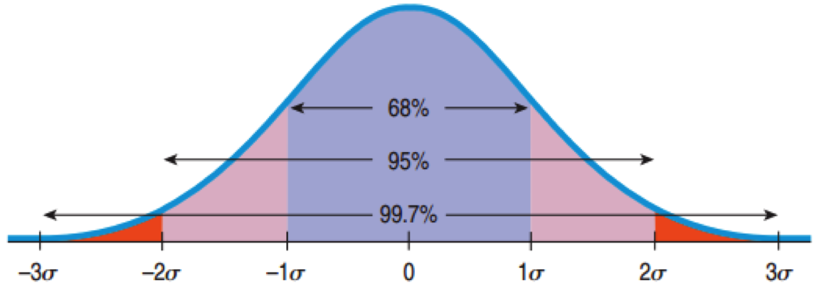

```{r setup, echo=FALSE, results='hide', warning=FALSE}
require(ggplot2)
require(gdata)
options(digits=4, width=95)
opts_chunk$set(fig.path='Figures/Class06-')
opts_chunk$set(comment=NA)
source('../R/contingency.table.R')


load('../Data/titanic.Rda')
movies <- read.csv('../Data/Textbook/Chapter_3/movie_lengths_2010.csv', stringsAsFactors=FALSE)
ozone <- read.csv('../Data/Textbook/Chapter_4/Ozone.csv', stringsAsFactors=FALSE)
ozone$Ozone <- as.numeric(ozone$Ozone)
ozone <- ozone[!is.na(ozone$Ozone),]

# See http://data.giss.nasa.gov/gistemp/tabledata_v3/GLB.Ts+dSST.txt
temp <- read.table('../Data/GlobalTemp.txt', header=TRUE, strip.white=TRUE)
temp$means <- rowMeans(aggregate(temp[,c("DJF","MAM","JJA","SON")], by=list(temp$Year), FUN="mean")[,2:5])
temp$meansF <- temp$means / 100 * 1.8

# temp2 <- melt(temp[,1:13], id='Year')
# temp2$value <- temp2$value / 100 * 1.8
# ggplot(temp2, aes(x=variable, y=value)) + geom_boxplot()

# World data
# countries = read.csv('../Data/WDI_GDF_Country.csv', strip.white=TRUE)
# worldData = read.csv('../Data/WDI_GDF_Data.csv', strip.white=TRUE)
# worldData2 = worldData[which(worldData$Series.Code %in% c('NY.GDP.MKTP.KD', 'SE.XPD.TOTL.GD.ZS', 'SP.DYN.LE00.IN', 'SP.POP.TOTL')), c('Series.Code', 'Series.Name', 'Country.Name', 'Country.Code', 'X2008')]
# worldData2 = merge(worldData2, countries[,c('Country.Code', 'Region')], by='Country.Code')
# worldData2 = worldData2[which(worldData2$Region != 'Aggregates'),]
# worldData2$Series.Name = as.factor(as.character(worldData2$Series.Name))
# worldData2$Region = as.factor(as.character(worldData2$Region))
# worldData3 = cast(worldData2, Country.Name + Region ~ Series.Name, mean, value='X2008')
# names(worldData3) = c('Country', 'Region', 'GDP', 'Life.Expectancy', 'Population', 'Education')
# worldData3$GDP.log = log(worldData3$GDP)
# worldData3$GDP = worldData3$GDP / 1000000000 #Billions
# worldData3$Population = worldData3$Population / 1000000 #Millions
load('../Data/WorldData.Rda')
worldData3 <- worldData3[!is.nan(worldData3$GDP),]
```

## Comparing Students

* Student A takes the SAT and scores 600 on the math component, 100 points higher than the average student.

* Student B takes the ACT and scores 27 on the math component, 9 points higher than the average student.

* Which student performed better?

---

## How many standard deviations?

        | SAT | ACT |
--------|-----|-----|
Mean    | 500 |  18 |
SD      | 100 |   6 |
Student | 600 |  27 |

### The standard deviation helps compare two different metrics.

* SAT: 600 - 500 = 100 (or 1 standard deviation)
* ACT: 27 - 18 = 9 (or 1.5 standard devations)

---

## The z-Score (or standard score)

$$ z=\frac { y-\overline { y }  }{ s } $$

* The z-score measures the distance of the value from the mean in standard deviations.
* A positive z-score indicates the value is above the mean.
* A negative z-score indicates the value is below the mean.
* A small z-score indicates the value is close to the mean when compared to the rest of the data values.
* A large z-score indicates the value is far from the mean when compared to the rest of the data values.

--- &twocol

## z-Scores for our Students

        | SAT | ACT |
--------|-----|-----|
Mean    | 500 |  18 |
SD      | 100 |   6 |
Student | 600 |  27 |

*** left

### SAT

$$ z=\frac { 600 - 500  }{ 100 } = 1 $$

*** right

### ACT

$$ z=\frac { 27 - 18 }{ 6 } = 1.5 $$

--- &twocol

## Shifting

If the same number is subtracted or added to all data values, then:
* The measures of the spread - standard deviation, range, and IQR - are all unaffected.
* The measures of position - mean, median, and mode - are all changed by that number.

*** left

```{r, fig.width=5, fig.height=4,tidy=FALSE, message=FALSE, tidy=FALSE}
ggplot(pisausa, aes(x=Math)) + 
geom_histogram()
```

*** right

```{r, fig.width=5, fig.height=4,tidy=FALSE, message=FALSE, tidy=FALSE}
ggplot(pisausa, aes(x=Math - 500)) + 
geom_histogram()
```

--- &twocol

## Scaling

If we multiply all data values by the same number, what happens to the position and spread?

When we multiply (or divide) all the data values by a  constant, all measures of position and all measures of  spread are multiplied (or divided) by that same constant.

```{r, message=FALSE, echo=FALSE, results='hide'}
data(cars)
names(cars) <- c('mph','dist')
cars$kph <- cars$mph / 1.609
speeds <- melt(cars[,c('mph','kph')])
```

*** left

```{r, fig.width=5, fig.height=4,tidy=FALSE, message=FALSE, tidy=FALSE}
ggplot(speeds, aes(x=variable, y=value)) + 
geom_boxplot()
```

*** right

```{r, fig.width=5, fig.height=3.5,tidy=FALSE, message=FALSE, tidy=FALSE}
ggplot(speeds, aes(x=value)) + 
geom_histogram() + 
facet_wrap(~ variable, ncol=1)
```


---

## Models

<q>All models are wrong, but some are useful.</q> - George Box

* −1 < z < 1:  Not uncommon
* z = ±3:  Rare
* z = 6:  Shouts out for attention!

---

## The Normal Model

* Bell Shaped:  unimodal, symmetric
* A Normal model for every mean and standard deviation.
	* $\mu$ (read “mew”) represents the population mean.
	* $\sigma$  (read “sigma”) represents the population standard deviation.
	* $N(\mu, \sigma)$ represents a Normal model with mean m and standard deviation s. 

$$f(x)\quad =\quad \frac { 1 }{ \sigma \sqrt { 2\pi  }  } { e }^{ -\frac { { \left( x-\mu  \right)  }^{ 2 } }{ { 2\sigma  }^{ 2 } }  }$$

* Parameters:  Numbers that help specify the model (i.e. $\mu$, $\sigma$)
* Statistics:  Numbers that summarize the data (e.g. $\overline{y}$, $s$, median, mode)
* $N(0, 1)$ is called the standard Normal model, or the standard Normal distribution.
* The Normal model should only be used if the data is approximately symmetric and unimodal.

---

## The 68-95-99.7 Rule

* 68% of the values fall within 1 standard deviation of the mean.
* 95% of the values fall within 2 standard deviations of the mean.
* 99.7% of the values fall within 3 standard deviations of the mean.




Finding percentiles: <a href='http://shiny.albany.edu/stat/stdnormal/' target='_blank'>http://shiny.albany.edu/stat/stdnormal/</a>

---

## Checking Normality

```{r, echo=FALSE, results='hide', eval=FALSE}
require(multilevelPSA)
pisausa <- pisana[pisana$CNT == 'USA',c('CNT','ST04Q01','PV1MATH')]
names(pisausa) <- c('CNT','Gender','Math')
pisausa <- pisausa[complete.cases(pisausa),]
```

At a minimum, plot a histogram.

```{r, fig.width=10, fig.height=5,tidy=FALSE, message=FALSE}
ggplot(pisausa, aes(x=Math)) + geom_histogram()
```

--- &twocol

## Normal Probability Plots: PISA Math

*** left

* Plots each value against the z-score that would be expected had the distribution been perfectly normal.
* If the plot shows a line or is nearly straight, then the Normal model works.
* If the plot strays from being a line, then the Normal model is not a good model.

*** right

```{r, fig.width=6, fig.height=6,tidy=FALSE, message=FALSE}
qqnorm(pisausa$Math)
```

--- &twocol

## Histograms: GDP

*** left

```{r, fig.width=5, fig.height=5,tidy=FALSE, message=FALSE}
hist(worldData3$GDP)
```

*** right

```{r, fig.width=5, fig.height=5,tidy=FALSE, message=FALSE}
hist(worldData3$GDP.log)
```

--- &twocol

## Normal Probability Plots: GDP

*** left

```{r, fig.width=5, fig.height=5,tidy=FALSE, message=FALSE}
qqnorm(worldData3$GDP)
```

*** right

```{r, fig.width=5, fig.height=5,tidy=FALSE, message=FALSE}
qqnorm(worldData3$GDP.log)
```

---

## What can go wrong?

* Don’t use the Normal model when the distribution is not unimodal and symmetric.  
* Always look at the picture first.
* Don’t use the mean and standard deviation when outliers are present.
* Check by making a picture.
* Don’t round your results in the middle of the calculation.
* Always wait until the end to round.
* Don’t worry about minor differences in results.
* Different rounding can produce slightly different results.

