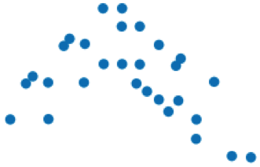

```{r setup, echo=FALSE, results='hide', warning=FALSE}
require(ggplot2)
require(gdata)
options(digits=4, width=95)
opts_chunk$set(fig.path='Figures/Class06-')
opts_chunk$set(comment=NA)
source('../R/contingency.table.R')

load('../Data/titanic.Rda')
movies <- read.csv('../Data/Textbook/Chapter_3/movie_lengths_2010.csv', stringsAsFactors=FALSE)
ozone <- read.csv('../Data/Textbook/Chapter_4/Ozone.csv', stringsAsFactors=FALSE)
ozone$Ozone <- as.numeric(ozone$Ozone)
ozone <- ozone[!is.na(ozone$Ozone),]

load('../Data/WorldData.Rda')
worldData3 <- worldData3[!is.nan(worldData3$GDP),]

# See http://data.giss.nasa.gov/gistemp/tabledata_v3/GLB.Ts+dSST.txt
temp <- read.table('../Data/GlobalTemp.txt', header=TRUE, strip.white=TRUE)
temp$means <- rowMeans(aggregate(temp[,c("DJF","MAM","JJA","SON")], by=list(temp$Year), FUN="mean")[,2:5])
temp$meansF <- temp$means / 100 * 1.8

fuel <- read.csv('../Data/Textbook/Chapter_6/Fuel_economy_2010.csv')
housing <- read.csv('../Data/Textbook/Chapter_6/Income_and_Housing.csv')

load('../Data/ipedsSAT.Rda')
ipedsSAT <- ipedsSAT[,c('SATMath','SATWriting','SATTotal','AcceptanceTotal','FullTimeRetentionRate')]
names(ipedsSAT)[5] <- 'Retention'
ipedsSAT <- ipedsSAT[complete.cases(ipedsSAT),]
```

## Scatterplots

* Scatterplots exhibit the relationship between two variables.
* Used for detecting patterns, trends, relationships, and extraordinary values.

```{r, fig.width=12, fig.height=5, tidy=FALSE, message=FALSE, tidy=FALSE}
ggplot(temp, aes(x=Year, y=means)) + geom_point()
```

-- &twocol

## Scatterplots

*** left

```{r, fig.width=6, fig.height=5, tidy=FALSE, message=FALSE, tidy=FALSE}
ggplot(fuel, aes(x=hp, y=mpg)) + geom_point()
```

*** right

```{r, fig.width=6, fig.height=5, tidy=FALSE, message=FALSE, tidy=FALSE}
ggplot(housing, aes(x=Median.income, y=Housing.Cost)) + geom_point()
```

---

## Direction of Association

* Negative Direction: As one goes up, the other goes down.  
	
* Positive Direction: As one goes up, the other goes up also.  
	
* No Direction  
	

---

## Form

* Linear:  The points cluster near a line.  
	
* Gently curves in a direction. May be able to straighten with a transformation.  
	
* Curves up and down.  Difficult to straighten  
	

---

## Strength of Relationship

* Strong linear relationship  
	
* Moderate linear relationship  
	
* No linear relationship  
	

---

## Variables

* <b>Response Variable</b> (y): The variable of interest.  It is what we want to predict.
* <b>Explanatory or Predictor Variable</b> (x): The variable that we use to provide information or a prediction of the response variable.
* Choosing the response variable and the explanatory variable depends on how we think about the problem.  

For example:

* Do baseball teams that score more runs also sell more tickets?  
	Tickets = Response (y), Runs = Explanatory (x)
* Do students with higher SAT scores get better grades?  
	Grades = Response (y), SAT score = Explanatory (x)
* Can we estimate a person’s BMI by measuring their wrist size?  
	BMI = Response (y), Wrist Size = Explanatory (x)

--- &twocol

## Correlation

*** left

* How strong is the relationship between SAT scores and full-time retention?
* For the green dots: z-scores have the same sign, so multiplying the z-scores produces a positive value.    
* For the red dots:  z-scores have opposite signs, so multiplying the z-scores produces a negative value.
* Define the correlation coefficient by an almost average product of the z-scores:

$$ r=\frac { \sum { { z }_{ x }{ z }_{ y } }  }{ n-1 } $$

```{r}
meanSAT = mean(ipedsSAT$SATTotal)
meanRetention = mean(ipedsSAT$Retention)
```

```{r, echo=FALSE, results='hide'}
ipedsSAT$Association = ifelse((ipedsSAT$SATTotal > meanSAT & ipedsSAT$Retention > meanRetention) | (ipedsSAT$SATTotal < meanSAT & ipedsSAT$Retention < meanRetention), '+', '-')
```

*** right

```{r, fig.width=6, fig.height=5, tidy=FALSE, message=FALSE, tidy=FALSE}
ggplot(ipedsSAT, aes(x=SATTotal, 
	y=Retention, color=Association)) + 
	geom_vline(xintercept=meanSAT) +
	geom_hline(yintercept=meanRetention) +
	geom_point()
```

---

## Assumptions and Conditions for Correlation

* To use r, there must be a true underlying <i>linear relationship</i> between the two variables.
* The variables must be <i>quantitative</i>.
* The pattern for the points of the scatterplot must be <i>reasonably straight</i>.
* Outliers can strongly affect the correlation.  Look at the scatterplot to make sure that there are <i>no strong outliers</i>. 

## Calculating correlation in R

```{r}
cor(ipedsSAT$SATTotal, ipedsSAT$Retention)
```

---

## Properites of Correlation

* r > 0 → positive association
* r < 0 → negative association
* −1 < r < 1, with r = − 1 only if the points all lie exactly on a negatively sloped line and r = 1 only if the points all lie exactly on a positively sloped line.
* Interchanging x and y does not change the correlation.
* r has no units.  
* Changing the units of x or y does not affect r.
* Measuring in dollars, cents, or Euros will all produce the same correlation.
* Correlation measures the strength of the linear association between the two variables.
* Correlation is sensitive to outliers.  An extreme outlier can cause a dramatic change in r.
* The adjectives weak, moderate, and strong can describe correlation, but there are no agreed upon boundaries.

---

## Correlation DOES NOT mean causation

* Causation is a possibility, but more must be done to prove causation.
* The causation could be in reverse (y causes x)
* A lurking variable may cause both.

---

## Guidelines for Re-Expressions

* Scatterplot bends downwards → $y^{2}$
* Scatterplot is linear → No change
* For data that is a count → $y^{\frac{1}{y}}$
* For data that is always positive → $log(y)$
* If nothing else seems to work try → $y^{-\frac{1}{2}}$
* For ratios such as miles per gallon → $\frac{1}{y}$

