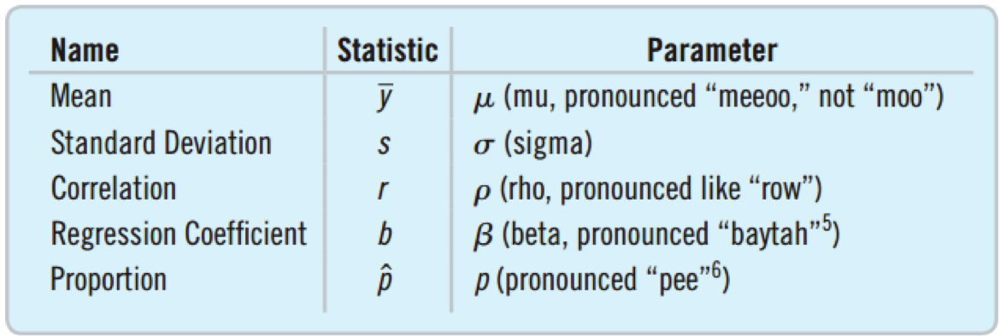

## Idea 1: Examine a Part of the Whole

* The Goal - Learn about the entire group of individuals (called the population)
* The Problem - It is usually impossible to collect data on the entire population.
* The Compromise - Collect data on a smaller group of individuals (called a sample) selected from the population.


---  

## Randomize

Can we list the characteristics of the population and ensure we represent them all without bias?

* Race, age, ethnicity, income, marital status, work type, family size, …
* The list would go on forever.

There are more types of people than the number of people.

* Randomizing can lead to a representative sample.
* Randomizing protects us from the influences of all the features of the population.
* On average, the sample will look like the population.

---

## Is the random sample representative?

```{r sampledf, echo=FALSE}
print(sampledf, row.names=FALSE)
```

* Samples 1 and 2 each include 8000 randomly selected company’s customers.
* Are the samples representative of all customers?
	* The outcomes for each of the 7 variables are similar for the two samples.
	* It is reasonable to assume that the samples are representative.

---

## Sample Size

If you need 100 students to get a random sample at the university, how many Americans would you need to achieve the same level of randomness from the entire U.S.A.?

Answer:  100

* It is the number of individuals, not the percent of individuals that matters.
* The number of individuals in the sample is called the sample size.

---

## How Big a Sample Do You Need?

To find the proportion of a certain category:

* Several hundred are needed.
* A smaller sample size will result in such a low precision that the results will have little use.

To find the average value:

* The sample size needed to get useful results will vary.

What do pollsters do?

* Generate random phone number (cell and landline)
* Representative even though only 38% answer.

---

## Census

Why not just include everyone?

* Surveying everyone is called a census.
* That would be best if we could.

Problems with a census
* Very expensive
* Takes too long
* Usually impossible to find everyone
* Not everyone is willing to participate.
* The population is always changing – births and deaths occur every day.

---

## Issues with a Census

Double Counting

* College students are often counted both at their colleges and where their parents live.

Under Counting:  Who is likely to be missed?

* The poor
* Undocumented immigrants
* Homeless

Should we use sampling instead of a census?

* Statisticians think so.
* Politicians don’t agree. 

---

## Parameter and Statistic

Base on a study a report stated that 21.7% of all U.S. teens do not wear seatbelts.

* Do they really know about all U.S. teens?
* They used the sample proportion to make inferences about the population proportion.
* A <i>parameter</i> is a number used in a model of the population.
* A <i>statistic</i> is a number that is calculated from the sample data.



---

## Representative Sampling

Since we can’t take a true census, we want to compute statistics that reflect the parameters.

* A sample that does the above is called a representative sample.
* Biased samples tend to not be representative.
* The statistic tends to be much higher or much lower than the parameter.

---

## Random But Not Representative

Random

* Suppose there are 20 men and 20 women in a class. Flip a coin.
* Heads:  Choose the 20 men.
* Tails:  Choose the 20 women.
* Every student has an equally likely chance of being chosen.  Randomness was achieved.
* This will not produce a representative sample.

---

## Simple Random Sampling

SRS

* Order the students from 1 to 40.
* Use a computer to randomly select 20 numbers from 1 to 40.
* Select the students with the chosen numbers.

Simple Random Sampling (SRS) is when every combination has an equally likely chance to be selected.

* SRS is the standard which all other sampling techniques are measured.
* Statistical theory is based on SRS.

---

## Sampling Frame

The sampling frame is the list of all individuals from which the sample is drawn.
Deciding on the sampling frame can be difficult.  If you want students at this college.  Do you include:

* Part-time students?
* Online students from another college taking one class at this college?
* Students on leave for a semester?
* Students studying abroad?

---

## Sampling Variability

* Samples will vary from one to the next.
* The first sample of five students might average 131 pounds.
* The second might average 138 pounds.

The sample to sample differences are called the sampling variability (or sampling error).

* Sampling variability is natural and does not mean there were biases or errors in the data collection.
* Sampling variability is not a problem.  It is an opportunity.

---

## Stratified Sampling

Stratified Sampling involves dividing the population into homogeneous groups called strata.  Then proportionate amounts from each group are selected from the sample.

* You want to survey 200 students about funding for the football team.
* The college is 60% women and 40% men.
* Survey 120 women and 80 men.

Benefits:

* Reduces Bias - At least there will not be bias towards one of the strata or another.
* Reduces Sampling Variability - If each strata tends to have higher or lower answers, then sampling variability is reduced. Estimates will be more precise.

---

## Cluster Sampling

How would you select a sample of 2000 trees to determine the average age of trees in the Yosemite National Forest?

* It would be impractical to conduct a SRS
* Instead select 20 parcels from diverse locations such that each parcel has 100 trees.

Splitting the population into several representative clusters and then selecting every individual from each of a few of these clusters is called cluster sampling.

Benefits:

* Can be less expensive and take less time. Especially when the population is spread out.
* Some populations are naturally broken into clusters. College students can be clustered by classes.
* Can help to ensure that everyone responds. Professors can make all the students in the class answer the survey.

---

## Multistage Sampling

Sampling schemes that contain several methods are called multistage sampling.

* Suppose you want to using sampling to find out how long sentences are in the textbook.
	* Stratified:  Select from each of the six parts.
	* SRS:  Use a computer to select three pages within each section.
	* Cluster:  Look at every sentence on each of the pages chosen.


