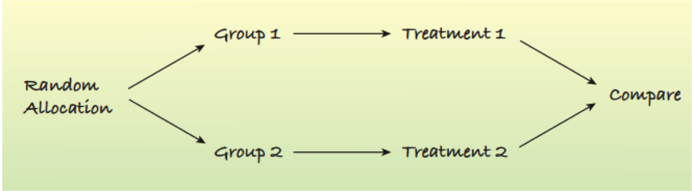
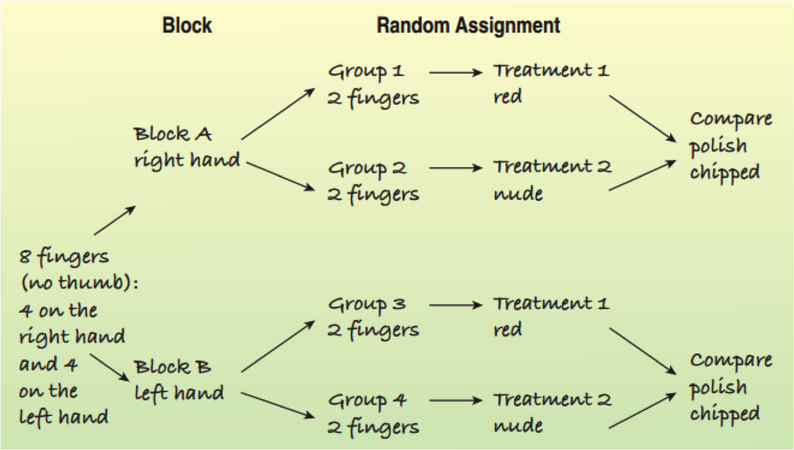
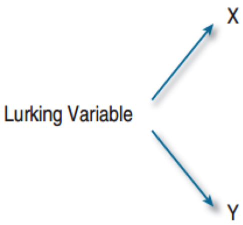
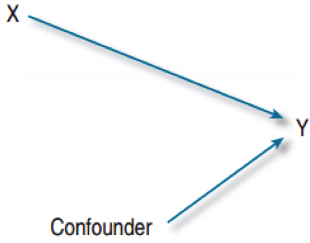

## Retrospective Studies

* Collect data on something that has already occurred
* Similar pros and cons as observational studies
* Additional issues can include:
* Unreliable memories
* Incomplete historical records
* Often limited to a small part of the population

---

## Prospective Study

A prospective study is a study where we identify subjects in advance and collect data as events unfold.

Pros:

* Possible to isolate the variables.
* With care, can establish cause and effect.
* Can design the study to your specifications.

Cons:

* Can be expensive.
* Rare occurrences require very large samples.
* Can take too long: Do breast-fed babies live longer than bottle-fed?

---

## Experiments

Is it possible to establish a cause and effect relationship?

* Take 100 young children. Randomly select 50 to be in a music program. The other 50 will not be allowed to play an instrument.
* An experiment requires random assignment of subjects to treatments.
* Only experiments can establish cause and effect.

---

## How Experiments Work

* Identify the explanatory variable(s), called the factor(s).
* Identify the response variable.
* Select subjects or participants (if human) or experimental units (if not human).
* Decide on the levels to choose for each factor.
	* Music program or no music program
	* Sleep hours:  4, 6, or 8
* The combination of specific levels from all factors that a subject receives is called its treatment.

---

## Assigning Participants to Treatments

* Don’t let them choose.
* Don’t assign based on what’s best for each.
* Randomly assign participants into groups.  Each group receives a different treatment.
* Only through random assignment can a cause-and-effect relationship be established.
* What ethical dilemmas might this introduce?

---

## The Four Principles of Experimental Design

1. Control
	* Make all conditions as similar as possible for all treatment groups.  
	* Control allows us to isolate the one thing that is being studied.  Helps avoid lurking variables

2. Randomize
	* Equalizes the effects of variation that we cannot control
	* Distributes the uncontrollable factors equally
	* Control what you can, randomize the rest.

---

## The Four Principles of Experimental Design (cont.)

3. Replicate
	* Apply each treatment to a number of subjects.
	* Repeat the entire experiment on an entirely different population of experimental units.

4. Block
	* Group similar individuals together and randomize within each of these blocks.
	* Blocking helps account for the variability due to the difference between blocks.

---

---

## Statistical Significance

A difference is called statistically significant if the difference is greater than what we would expect from random chance.

Flip a coin 100 times:
* 52 tails is not statistically significant since it would not be surprising to observe this outcome.
* 93 tails is statistically significant since it would be surprising to observe this outcome.

---

## Random Samples and Random Treatments

* Surveys use a random group of participants.
* Experiments find a homogeneous group, separate them into random subgroups for treatment.
* Experiments do not use a random sample from the population.
* Beware of stating that the participants from the experiment represent the larger population.

---

## Blinding

What brand of cola is the best?

* If you give participants cans of cola and ask how much they like it, the label can be an influence.
* Instead give each an unlabeled cup of soda.
* Single-blinding involves the participants not knowing whether they are in the control or treatment group.
* If the person handing out the cups hands out her favorite soda she may bias the results.
* Double-blinding means neither the participant nor the person handing out the soda knows the label.

---

## Who Can Affect the Experiment

There are two main classes of individuals who can affect the experiment.

Those who can influence the results.

* Subjects
* Treatment administrators
* Technicians

Those who evaluate the results.

* Judges 
* Treating Physicians

---

## Placebos

* A placebo is a “fake” treatment that looks like the treatment being tested.
* Just telling a patient that they are being treated can aid recovery.
* This is called the placebo effect.
* Use a placebo for effective blinding.

---

## Blocking

* Experimental units can be separated into groups that are not the treatment, we call these groups blocks.
* Blocking involves randomly assigning the treatments within each block.
* Blocking helps isolate the variability due to the differences between blocks.
* Blocking helps clarify the difference between the treatments.
* The design is called a randomized block design.

---

</center

---

## Animated Teaching vs. Subdued Teaching

Professor Ceci taught the same course in the fall and the spring.

* Fall:  Subdued manner, everything else the same
* Spring:  High enthusiasm, animated gestures

Results:  How much did you learn? (1-5)

* Fall:  2.93
* Spring:  4.05

Conclusions

* Animated teaching better than subdued teaching???
* Weather:  Fall ends gloomy, spring ends pleasant.

---

## Confounding Factors

* Two factors are confounded if the levels of one are associated with the levels of the other.
* Weather and Professor Cecil’s style were confounded.
* Try to avoid confounding factors, but it is difficult and sometimes impossible.
* Avoiding confounding factors can introduce new ones.
* Compare morning and afternoon fall courses.

--- &twocol

## Lurking and Confounding

*** left

Lurking Variable

* Associated with both x and y
* Makes it appear that x causes y

Confounding Variable

* Associated in a noncausal waywith a factor
* Affects the response
* Can’t tell if the cause was the factoror confounding variable

*** right

