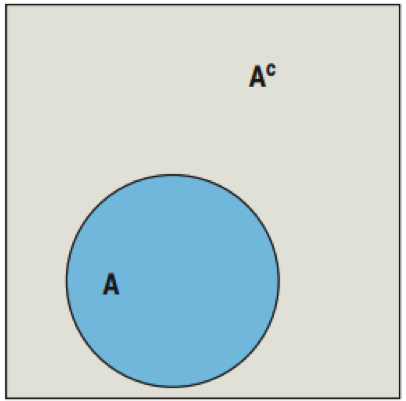
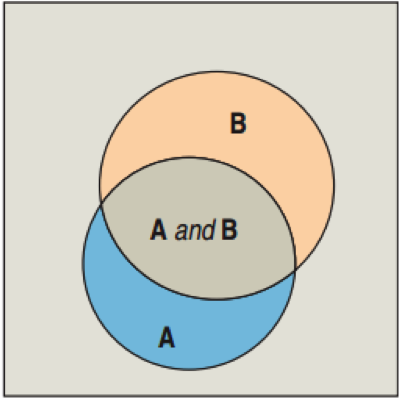

## The Law of Large Numbers

* If you flip a coin once, you will either get 100% heads or 0% heads.
* If you flip a coin 1000 times, you will probably get close to 50% heads.

The Law of Large Numbers states that for many trials, the proportion of times an event occurs settles down to one number.
* This number is called the <b>empirical probability</b>.

### Requirements:

* Identical Probabilities: The probabilities for each event must remain the same for each trial.
* Independence: The outcome of a trial is not influenced by the outcomes of the previous trials.

Empirical probability: $P(A)=\frac { num \quad times\quad A\quad occurs }{ num \quad of\quad trials } $ (in the long run)

---&twocol

### Red Light, Green Light:  The Law of Large Numbers

* After many days, the proportion of green lights encountered is approximately 0.34.
* P(green) = 0.34.
* If we recorded more days, the probability would still be about 0.34.

*** left

```{r cumsum2, fig.width=6,fig.height=5,tidy=FALSE,echo=FALSE}
flips <- sample(c(0,1,0), 100, replace=TRUE)
df <- data.frame(day=1:100, 
	PercentGreen=cumsum(flips) / 1:100)
ggplot(df, aes(x=day, y=PercentGreen)) + 
	geom_path() + ylim(c(0,1))
```

*** right

```{r cumsum3, fig.width=6,fig.height=5,tidy=FALSE,echo=FALSE}
flips <- sample(c(0,1,0), 500, replace=TRUE)
df <- data.frame(day=1:500, 
	PercentGreen=cumsum(flips) / 1:500)
ggplot(df, aes(x=day, y=PercentGreen)) + 
	geom_path() + ylim(c(0,1))
```

---

### The Nonexistent Law of Averages

<b>Wrong</b>

* If you flip a coin 5 times and get five tails, then you are due for a head on the next flip.
* You put 10 quarters in the slot machine and lose each time.  You are just a bad luck person, so you have a smaller chance of winning on the 11th try.

* There is no such thing as the Law of Averages for short runs.

---

### Theoretical Probability

American Roulette
* 18 Red, 18 Black, 2 Green
* If you bet on Red, what is the probability of winning?

Theoretical Probability

$$P(A)=\frac { num \quad times\quad A\quad occurs }{ num \quad of\quad trials } $$
$$P(red)=\frac{18}{38}$$

---

### Heads or Tails

Flip 2 coins.  Find P(HH)
* List the sample space:  
	S = {HH, HT, TH, TT}
* $P(HH) = \frac{1}{4}$

Flip 100 coins.  Find the probability of all heads.
The sample space would involve 1,267,650,600,228,229,401,496,703,205,376 different outcomes.
Later, we will see a better way.

---

### Equally Likely?

What’s wrong with this logic?
* Randomly pick two people.
* Find the probability that both are left-handed.
* Sample Space  
	S = {LL, LR, RL, RR}
* $P(LL) =\frac{1}{4}$

Since left-handed and right-handed are not equally likely, this method does not work.  

---

### Personal Probability

What’s your chance of getting an A in statistics?
* You cannot base this on your long-run experience.
* There is no sample space of events with equal probabilities to list.
* You can only base your answer on personal experience and guesswork.
* Probabilities based on personal experience rather than long-run relative frequencies or equally likely events are called personal probabilities.

---

### Rules 1 and 2

Rule 1:  0 ≤ P(A) ≤ 1
* You can’t have a −25% chance of winning.
* A 120% chance also makes no sense.
* Note:  Probabilities are (generally) written in decimals.
	* 45% chance → P(A) = 0.45

Rule 2:  P(S) = 1

* The set of all possible outcomes has probability 1.
* There is a 100% chance that you will get a head or a tail.

--- &twocol

### Rule 3: The Complement Rule

*** left

Complements
* Define $A^C$ as the complement of A.
* $A^C$ is the event of A not happening.
* If A is the event of rolling a 5 on a six sided die, then AC is the event of not rolling a 5: {1, 2, 3, 4, 6}
* $P(A) = 1/6$; $P(A^C) = ?$
* $P(A^C) = 5/6 = 1 – 1/6$

The Rule of Complements:  $P(A^C) = 1 – P(A)$

*** right



---

### Red Light Green Light and Complements

We know that P(green) = 0.34. Find P(not green):
* Not green is the complement of green.
* Use the rule of complements:  
	$P(not green) =  P(green^C)$  
	P(not green) = 1 – P(green)  
	P(not green) = 1 – 0.34  
	P(not green) = 0.66  
	
The probability of the light not being green is 0.66.

--- &twocol

### Rule 4:  The Addition Rule

*** left

Suppose  
	P(sophomore) = 0.2 and P(junior) = 0.3

Find P(sophomore OR junior)  
	Solution:  0.2 + 0.3  =  0.5

This works because sophomore and junior are disjoint  events. They have no outcomes in common.

The Addition Rule
* If A and B are disjoint events, then

$$P(A\quad OR\quad B)  =  P(A) + P(B)$$

*** right



---

### Red Light, Green Light, Yellow Light

Given that P(green) = 0.35 and P(yellow) = 0.04
* Find P(red).

Solution:  Use the Rule of Complements and the Addition Rule.

$P(red) = 1 – P(red^C)$  
$P(red) = 1 – P(green OR yellow)$  
$P(red) = 1 – [P(green) + P(yellow)]$  
$P(red) = 1 – [0.35 + 0.04]$  
$P(red) = 1 – 0.39$  
$P(red) = 0.61$  

---

### The Sum of Probabilities

The sum of all the probabilities of every disjoint event must equal 1.  

What’s wrong with the following statement?
* Probabilities for freshmen, sophomore, junior, senior are:  0.25, 0.23, 0.22, 0.20.  
	0.25 + 0.23 + 0.22 + 0.20 = 0.90
* Since they do not add to 1, something is wrong.

How about the following?
* P(owning a smartphone) = 0.5 and 
* P(owning a computer) = 0.9
* This is fine, since they are not disjoint.

---

### Rule 5:  The Multiplication Rule

The probability that an Atlanta to Houston flight is on time is 0.85.
* If you have to fly every Monday, find the probability that your first two Monday flights will be on time.

Multiplication Rule:  For independent events A and B:
        $$P(A\quad AND\quad B)  =  P(A) × P(B)$$

P(1st on time AND 2nd on time) =  P(1st on time) × P(2nd on time)  
P(1st on time AND 2nd on time) = 0.85 × 0.85  
P(1st on time AND 2nd on time) = 0.7225

---

### Red Light AND Green Light AND Yellow Light

Find the probability that the light will be red on Monday, green on Tuesday, and yellow on Wednesday.

* The multiplication rule works for more than 2 events.
* P(red Mon. AND green Tues. AND yellow Wed.) =   
		P(red Mon.) × P(green Tues.) × P(yellow Wed.) =  
		0.61 × 0.35 × 0.04 =  
		0.00854

---

### At Least One Red Light

Find the probability that the light will be red at least one time during the week.

Use the Complement Rule

P(at least 1 red) = 1 – P(no reds)   
= 1 – (0.39 × 0.39 × 0.39 × 0.39 × 0.39 × 0.39 × 0.39)  
≈ 0.9986

--- &twocol

### M&Ms: 38% Pink, 36% Teal, 16% Purple

* First notice that 0.38 + 0.36 + 0.16 = 0.9 ≠ 1
* There must be other colors.

*** left

Question:  Find the probability that a Japanese survey respondent will want either pink or teal.  
	P(pink OR teal)

* Pink and teal are disjoint.
* Apply the Addition Rule.

*** right

Question:  P(1st purple AND 2nd purple)  
	Find the probability that two Japanese survey respondents will want purple.

* The choice made by the first respondent does not affect the choice of the other.  The events are independent.
* Use the Multiplication Rule.

--- &twocol

### M&Ms: 38% Pink, 36% Teal, 16% Purple

*** left

Question:  P(pink OR teal)

Mechanics:  
* P(pink OR teal) = P(pink) + P(teal)  
	P(pink OR teal) = 0.38 + 0.36  
	P(pink OR teal) = 0.74

Conclusion:  The probability that the respondent chose pink or teal is 0.74.

*** right

Question:  P(1st purple AND 2nd purple)

* Mechanics:  
	P(1st purple AND 2nd purple) = P(1st purple) × P(2nd purple)  
	P(1st purple AND 2nd purple) = 0.16 × 0.16  
	P(1st purple AND 2nd purple) =  0.0256

Conclusion:  The probability that both choose purple is 0.0256.

