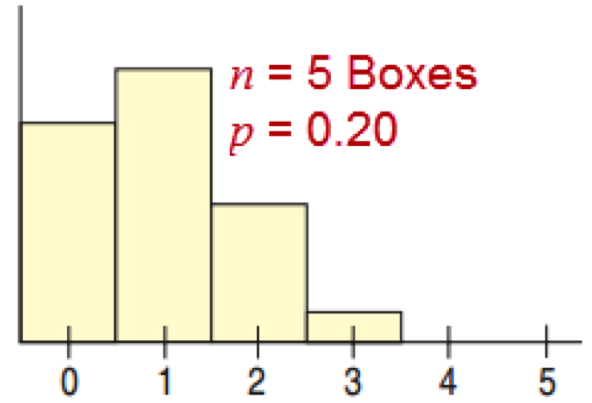
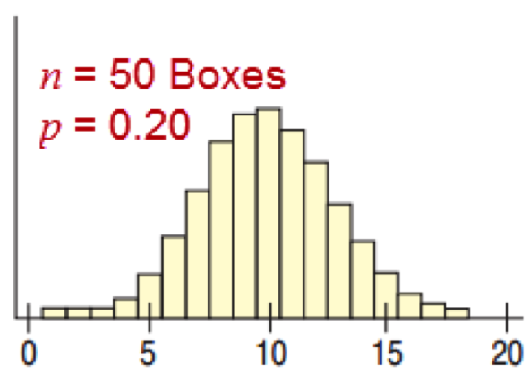
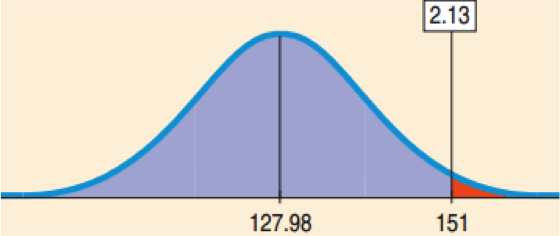

### Adding or Subtracting a Constant

* Adding or subtracting a constant to all the data values shifts the expected value by that constant.

$$E(X+c)\quad =\quad E(X)\quad +\quad c\\ E(X-c)\quad =\quad E(X)\quad -\quad c$$

* Adding or subtracting a constant to all the data values has no effect on the standard deviation.

$$Var(X\pm c)\quad =\quad Var(X)\\ SD(X\pm c)\quad =\quad SD(X)$$

---

### A Coupon on Top of the Valentine’s Discount

The Valentine's Discount
* E(X) = 5.83,  SD(X) = 8.62

If everybody brings a coupon for 5 off, what are the new expected value and standard deviation?
* E(X + 5) = 5.83 + 5 = 10.83
* SD(X + 5) = 8.62

---

### Multiplying by a Constant

$$E(cX)\quad =\quad cE(X)\\ Var(cX)\quad =\quad { c }^{ 2 }Var(X)\\ SD(cX)\quad =\quad |c|SD(X)$$

* There is a double the rewards special Valentines Day discount.  The rewards are now 40 and 20 instead of 20 and 10.  What  are the new expected value and standard deviation?
* $E(2X)\quad =\quad 2E(X)\quad =\quad (2)(5.83)\quad =\quad 11.66$
* $SD(2X)\quad =\quad 2SD(X)\quad =\quad (2)(8.62)\quad =\quad 11.74$
* With the double rewards special the restaurant expects an average discount of 11.66 and a standard deviation of 17.24.

---

### The Addition Rule

$$E(X+Y)\quad =\quad E(X)\quad +\quad E(Y)\\ Var(X+Y)\quad =\quad Var(X)\quad +\quad Var(Y)$$

  
* Two couples try the Valentines Day discount. For each:  E(X) = 5.83 and SD(X) = 8.62.
* What is the combined expected value and SD?
* Let the total discount be: $T = { X }_{ 1 }+{ X }_{ 2 }$
$$E({ X }_{ 1 }+{ X }_{ 2 }) = E({ X }_{ 1 }) + E({ X }_{ 2 }) = 5.83 + 5.83 = 11.66$$
$$Var({ X }_{ 1 }+{ X }_{ 2 }) = Var({ X }_{ 1 }) + Var({ X }_{ 2 }) = { 8.62 }^{ 2 }+{ 8.62 }^{ 2 } = 148.6088$$
$$SD({ X }_{ 1 }+{ X }_{ 2 }) = \sqrt { 148.6099 }  = 12.19$$
* Notice that since the variables are independent, the standard deviation, 12.19, is less than the standard deviation, 17.24, of the double discount.

---

### The Subtraction Rule

* Roll two dice.  Each die outcome will have the same SD.  
* Subtracting the standard deviations gives 0, but the standard deviation of the differences is not 0.  
* The range of the differences is −5 to 5, larger than the range for a single die: 1 to 6.

$$E(X-Y)=E(X)-E(Y)\\ Var(X-Y)=Var(X)+Var(Y)$$

---

### Subtracting Discounts

* A competing restaurant also has a game style discount: E(X) = 10, SD = 15.  
* How much more can you expect to save compared with the Valentines Day Discount: E(X) = 5.83, SD = 8.62?
* E(W – X) = 10 – 5.83 = 4.17
* What is the standard deviation of the differences?
* The competing restaurant’s discount averages 4.17 more than the Valentines Day Discount. The standard deviation for the difference is 17.30.

--- &twocol

### The Binomial Model


*** left

#### Searching for Walt's Card (see class 9)

* 20% of the cereal boxes have Walt’s card.
* What is the expected number of boxes to open to get a Walt card?

Bernoulli Trial

* Two outcomes:  success or failure
* The probability of success,  p, is the same for each trial.
* The trials are independent.

*** right

#### The 10% Rule

* There are 10 cereal boxes and you sample 4 of them.
* Not independent, since the probability of success changes for the second if you have success on the first
* If the sample is more than 10% of the population, then the trials are far from being independent.

--- &twocol

### Probability of Getting 2 Walt in 5 Trials

*** left

* Bernoulli trials:  Millions of boxes, sample size 5.
* P(X = 2) from Binom(n, p), n = 5, p = 0.2, q = 0.8.
* 2 successes, 3 failures.  No quite $0.2^2$ × $0.8^3$.
* Must consider all orders of 2 successes and 3 failures.
* Number of ways of picking k items from n:

$${ _{ n }{ C }_{ k } }=\frac { n! }{ k!(n-k)! } \\ { _{ 5 }{ C }_{ 2 } }=\frac { 5! }{ 2!(5-2)! } =10$$

* P(X = 2)  =  10 × 0.22 × 0.83 = 0.2048 

*** right

* n = Number of trials
* p = Probability of success
* q = 1 – p = Probability of failure
* X = Number of successes
* $P(X=x)={ _{ n }{ C }_{ x }{ p }^{ x }{ q }^{ n-x } }$
* Mean = $np$
* Standard Deviation = $\sqrt { nqp } $


---

### Binomial Models Using R

```{r,tidy=FALSE}
dbinom(x=2, size=5, prob=0.2)
cards <- data.frame(Card=c('Walt',
		'Jesse','Hank'),
		Prob=c(.2,.3,.5))
dbinom(2, 5, prob=cards$Prob)
```

---

### Spam and the Binomial Model

91% of all email is spam.  Your inbox has 25 emails. Find the mean, standard deviation, and the probability that 1 or 2 of the emails are not spam.

* n = 25, p = 1 – 0.91 = 0.09, q = 0.91
* Mean:  np = (25)(0.09)  =  2.25
* Standard Deviation = $\sqrt { nqp } =\sqrt { (25)(0.09)(0.91) } \approx 1.43$
* P(X = 1 or X = 2) = P(X=1) + P(X=2) = 0.2340 + 0.2777 = 0.5117 

There is about a 51% chance of 1 or 2 emails that are not spam.

```{r}
dbinom(1, 25, 0.09) + dbinom(2, 25, 0.09)
```

---

### The Trouble with Large Sample Sizes

The Red Cross has 32,000 donors and needs at least 1850 that are O−. Will they run out?
* The computations involve ridiculously  large numbers.
* “At least” requires P(X = 1850), P(X = 1851), all the way up to P(X = 32,000).
* Mean = np = 1920
* $SD = \sqrt{npq} \approx 42.48$

--- 

### The Solution for Large Sample Sizes

The Red Cross has 32,000 donors and needs at least 1850 that are O−.  Will they run out (less than)?

* Mean = np = 1920
* $SD = \sqrt{npq} \approx 42.48$
* The normal model with the same mean and standard deviation is a very good approximation.
$$P(X<1850)\approx P\left( z<\frac { 1850-1920 }{ 42.48 }  \right) \approx P(z<-1.65)\approx 0.05$$

There is about a 5% chance that they will run out.

--- &twocol

### How Large is “Large Enough”

*** left

The Success/Failure Condition
* A Binomial is approximately Normal if we expect at least 10 successes and 10 failures.
	* $np\ge 10$
	* $nq\ge 10$
* This comes from the binomial being skewed for a small number of successes or failures expected.

*** right





---

### Example:  Spam and the Normal Approximation to the Binomial

Only 151 of 1422 emails got through your spam filter.  Might the filter be too aggressive?
* What is the probability that no more than 151 of the emails are real messages?
* These emails represent less than 10% of all emails.
* $np = (1422)(0.09) = 127.98 \ge 10$
* $nq = (1422)(0.91) = 1294.02 \ge 10$
* Yes, the Normal model is a good approximation.

---

### Example:  Spam and the Normal Approximation to the Binomial

What is the probability that no more than 151 of the emails are real messages?
* $\mu = np = 127.98$
* $\sigma = \sqrt{npq} \approx 10.79$
* $P(X<151)\approx P\left( z<\frac { 151-127.98 }{ 10.79 }  \right) \approx P(z<2.13)\approx 0.9834$

There is over a 98% chance that no more than 151 of them were real messages.  The filter may be working.

<center></center>


