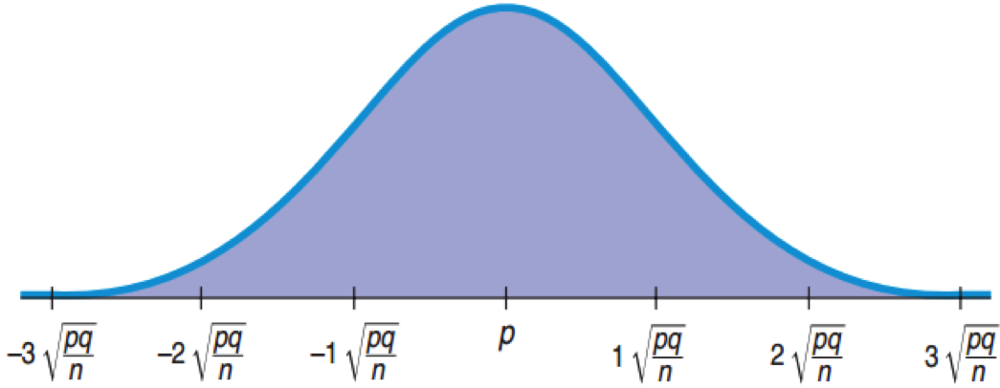
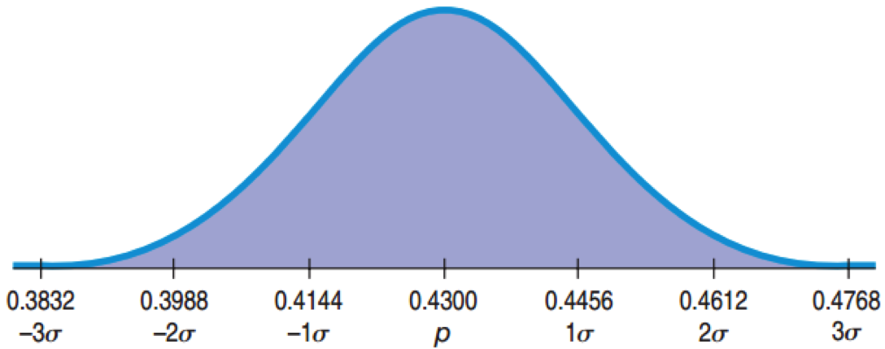
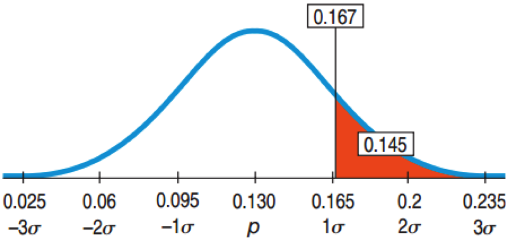
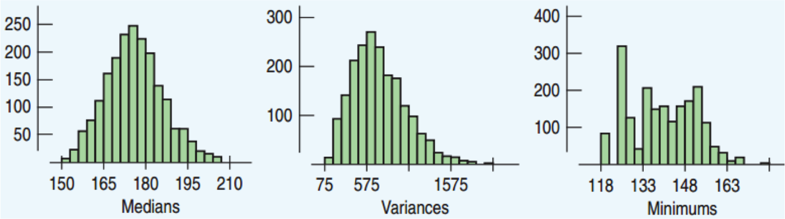
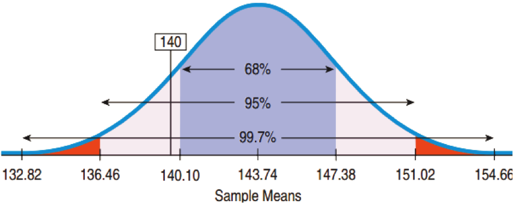
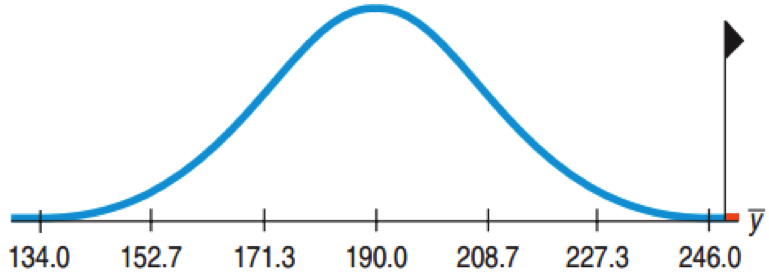
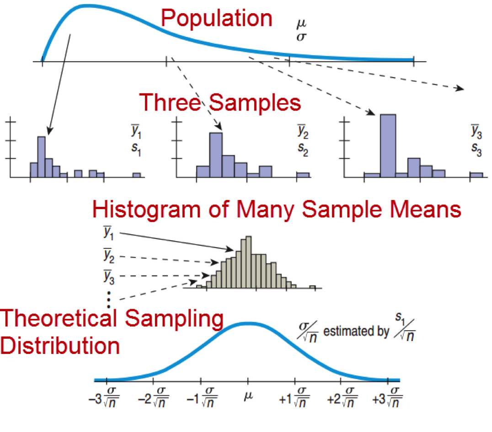

## Mean and Standard Deviation

Sampling Distribution for Proportions

* Mean = $p$
* Standard Deviation:
$\sigma (\hat { p } )=\frac { \sqrt { npq }  }{ n } =\sqrt { \frac { pq }{ n }  } $

<center></center>

---

## The Normal Model for Evolution

Population:  p = 0.43, n = 1007.  Sampling Distribution:

* Mean = 0.43
* $\sigma (\hat { p } )=\sqrt { \frac { (0.43)(0.57) }{ 1007 }  } \approx 0.0156$

<center></center>

---

## Smokers Revisited

p = 0.18, n = 1000

* Standard deviation = $\sigma (\hat { p } )=\sqrt { \frac { (0.18)(0.82) }{ 1000 }  } \approx 0.0121$
* Standard deviation from simulation:  0.0122

The sample-to-sample standard deviation is called the standard error or sampling variability.
* The standard error is not an error, since no error has been made.

---

## When Does the Normal Model Work?

* Success Failure Condition: $np \ge 10$, $nq \ge 10$  There must be at least 10 expected successes and failures.
* Independent trials:  Check for the Randomization Condition.
* 10% Condition:  Sample size less than 10% of the population size

--- &twocol

## Understanding Health Risks

22% of US women have a BMI that is above the 25 healthy mark.
Only 31 of the 200 randomly chosen women from a large college had a BMI above 25.  Is this proportion unusually small?


*** left

* Success Failure Condition: $np \ge 10$, $nq \ge 10$  There must be at least 10 expected successes and failures.
* Independent trials:  Check for the Randomization Condition.
* 10% Condition:  Sample size less than 10% of the population size

*** right

* Randomization Condition:  Yes, the women were randomly chosen.
* 10% Condition:  For a large college, this is ok.
* Success Failure Condition:  $31 \ge 10$, $169 \ge 10$
* Yes, the Normal model can be used.

---

## Understanding Health Risks

n = 200, p = 0.22, x = 31

* $\hat { p } =\frac { 31 }{ 200 } =0.155$
* $p = 0.22$
* $SD(\hat { p } )=\sqrt { \frac { (0.22)(0.78) }{ 200 }  } \approx 0.029$
* $z = \frac{0.155 - 0.22}{0.029} \approx -2.24$
* 68-95-99.7 Rule:  Values 2 SD below the mean occur less than 2.5% of the time.  Perhaps this college has a higher proportion of healthy women, or women who lie about their weight.

---

## Enough Lefty Seats?

13% of all people are left handed.
* A 200-seat auditorium has 15 lefty seats.
* What is the probability that there will not be enough lefty seats for a class of 90 students?

Plan:  15/90 ≈ 0.167, Want $P(\hat{p}) > 0.167)$
Model:
* Independence Assumption:  With respect to lefties, the students are independent.
* 10% Condition:  This is out of all people.
* Success/Failure Condition:  $15 \ge 10$, $75 \ge 10$

--- &twocol

## Enough Lefty Seats?

*** left 

Model:
* $p = 0.13$
* $SD(\hat { p } )=\sqrt { \frac { (0.13)(0.87) }{ 90 }  } \approx 0.035$
Show:
* Plot
* Mechanics: $z = \frac{0.167 - 0.13}{0.035} \approx 1.06$  
$P(\hat{p}) > 0.167) = P(z > 1.06) \approx 0.1446$

* Conclusion:  There is about a 14.5% chance that there will not be enough seats for the left handed students in the class.

*** right

<center></center>

---

## The Sampling Distribution for Others

* There is a sampling distribution for any statistic, but the Normal model may not fit.
* Below are histograms showing results of simulations of sampling distributions.


<center></center>

* The medians seem to be approximately Normal.
* The variances seem somewhat skewed right.
* The minimums are all over the place.
* In this course, we will focus on the proportions and the means.

--- &twocol

## Sampling Distribution of the Means

*** left

* For 1 die, the distribution is Uniform.
* For 3 dice, the sampling distribution for the means is closer to Normal.
* For 20 dice, the sampling distribution for the means is very close to normal. The standard deviation is much smaller.

*** right

```{r, fig.width=5,fig.height=2.5, echo=FALSE, results='hide', message=FALSE}
set.seed(2112)
dice <- data.frame(roll=1:10000)
for(i in 1:20) {
	dice[,paste0('dice', i)] <- sample(1:6, nrow(dice), replace=TRUE)
}
dice$dice3.mean <- apply(dice[,2:4], 1, mean)
dice$dice20.mean <- apply(dice[,2:21], 1, mean)
ggplot(dice, aes(x=factor(dice1))) + geom_histogram()
ggplot(dice, aes(x=dice3.mean)) + geom_histogram() + xlim(c(1,6)) + xlab('3-Dice Average')
ggplot(dice, aes(x=dice20.mean)) + geom_histogram() + xlim(c(1,6)) + xlab('20-Dice Average')

```

--- &twocol

## The Central Limit Theorem

*** left

The Central Limit Theorem
* The sampling distribution of any mean becomes nearly Normal as the sample size grows.

Requirements
* Independent
* Randomly collected sample

The sampling distribution of the means is close to Normal if either:
* Large sample size
* Population close to Normal

*** right 

Population Distribution and Sampling Distribution of the Means

Population Distribution
* Normal →   Normal (any sample size)
* Uniform →   Normal (large sample size)
* Bimodal →   Normal (larger sample size)
* Skewed →   Normal (larger sample size)

---

## Binomial Distributions and the Central Limit Theorem

* Consider a Bernoulli trial as quantitative:  
	* Success = 1
	* Failure = 0
* The mean of many trials is just $\hat{p}$
* This distribution of a single trial is far from Normal.
* By the Central Limit Theorem, the Binomial distribution is approximately normal for large sample sizes.

---

## Standard Deviation of the Means

* Which would be more unusual:  a student who is 6’9” tall in the class or a class that has mean height of 6’9”?
* The sample means have a smaller standard deviation than the individuals.
* The standard deviation of the sample means goes down by the square root of the sample size:

$$SD(\bar{y})=\frac{\sigma}{\sqrt{n}}$$

---

## The Sampling Distribution Model for a Mean

When a random sample is drawn from a population with mean $\mu$ and standard deviation $\sigma$, the sampling distribution has:
* Mean: $\mu$
* Standard Deviation: $SD(\bar{y})=\frac{\sigma}{\sqrt{n}}$

For large sample size, the distribution is approximately normal regardless of the population the random sample comes from.
The larger the sample size, the closer to Normal.

---

## Low BMI Revisited

The 200 college women with the low BMI reported a mean weight of only 140 pounds.  For all 18-year-old women, $\mu = 143.74$ and $\sigma = 51.54$.  Does the mean weight seem exceptionally low?
* Randomization Condition:  The women were a random sample with weights independent.
* Sample size Condition:  Weights are approximately Normal. 200 is large enough

* $\mu(\bar{y}) = 143.7$
* $SD(\bar { y } )=\frac { \sigma  }{ \sqrt { n }  } =\frac { 51.54 }{ \sqrt { 200 }  } \approx 3.64$

* The 68-95-99.7 rule suggests that the mean is low but not that unusual.  Such variability is not extraordinary for samples of this size.

<center></center>

--- &twocol

## Too Heavy for the Elevator?

Mean weight of US men is 190 lb, thestandard deviation is 59 lb.  An elevator has a weight limit of 10 persons or 2500 lb.  Find the probability that 10 men in the elevator will overload the weight limit.

*** left

* Plan:  10 over 2500 lb same as their mean over 250.
* Model:  
	* Independence Assumption:  Not random, but probably independent.
	* Sample Size Condition:  Weight  approx. Normal.
* Model:  $\mu = 190$, $\sigma = 59$
* By the CLT, the sampling distribution of is approximately Normal:
$$SD(\bar { y } )=\frac { \sigma  }{ \sqrt { n }  } =\frac { 59 }{ \sqrt { 10 }  } \approx 18.66$$

*** right

<center></center>

* Mechanics: $z=\frac { \bar { y } -\mu  }{ SD(\bar { y } ) } =\frac { 250-190 }{ 18.66 } \approx 3.21$
* $P(\bar{y} > 250) \approx P(z > 3.21) \approx 0.0007$
* Conclusion:  There is only a 0.0007 chance that the 10 men will exceed the elevator’s weight limit.

---

## Sample Size and Standard Deviation

* $SD(\bar{y}) = \frac{ \sigma }{ \sqrt{n} }$
* $SD(\hat{p}) = \frac{ \sqrt{pq} }{ \sqrt{n} }$
* Larger sample size → Smaller standard deviation
* Multiply n by 4 → Divide the standard deviation by 2.
* Need a sample size of 100 to reduce the standard deviation by a factor of 10.

---

## Distribution of the Sample vs. the Sampling Distribution

Don’t confuse the distribution of the sample and the sampling distribution.
* If the population’s distribution is not Normal, then the sample’s distribution will not be normal even if the sample size is very large.
* For large sample sizes, the sampling distribution, which is the distribution of all possible sample means from samples of that size, will be approximately Normal.

* Sampling distributions arise because samples vary.  Each random sample will contain different cases and, so, a different value of the statistic.
* Although we can always simulate a sampling distribution, the Central Limit Theorem saves us the trouble for proportions and means.  This is especially important when we do not know the population’s distribution.

---

<center></center>
