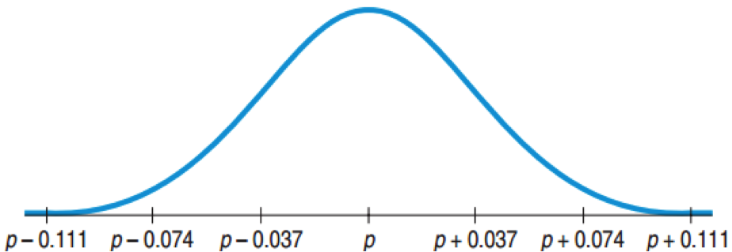

## Interpreting this Normal Curve

* By normality, about 95% ofall possible samples of 156 young Facebook users will have $\hat{p}$’s within 2 SE’s of p.
* If $\hat{p}$ is close to p, then p is close to $\hat{p}$.
* If you stand at $\hat{p}$, then you can be 95% sure that p is within 2SE’s from where you are standing.

---

## What You Cannot Say About p if You Know $\hat{p}$

30.8% of all Facebook users update their status daily.
* We can’t make such absolute statements about p.

It is probably true that 30.8% of all Facebook users update their status daily.
* We still cannot commit to a specific value for p, only a range.

We don’t know exactly what percent of all Facebook users update their status daily, but we know it is within the interval 30.8% ± 2 X 3.7%.
* We cannot be certain it is in this interval.

---

## What You Can Say About p if You Know $\hat{p}$

We don’t know exactly what percent of all Facebook users update their status daily, but the interval from 23.4% and 38.2% probably contains the true proportion.
* Note, we admit we are unsure about both the exact proportion and whether it is in the interval.

We are 95% confident that between 23.4% and 38.2% of all Facebook users update their status daily
* Notice “% confident” and an interval rather than an exact value are stated.

---

## Naming the Confidence Interval

This confidence interval is a one-proportion z-interval.
* “One” since there is a single survey question.
* “Proportion” since we are interested in the proportion of Facebook users who update their status daily.
* “z-interval”  since the distribution is approximately normal.

---

## Capturing a Proportion

* The confidence interval may or may not contain the true population proportion.

* Consider repeating the study over an over again, each time with the same sample size.
	* Each time we would get a different $\hat{p}$
	* From each $\hat{p}$, a different confidence interval could be computed.
	* About 95% of these confidence intervals will capture the true proportion.
	* 5% will be duds.

---

## Confidence Intervals

There are a huge number of confidence intervals that could be drawn.
* In theory, all the confidence intervals could be listed.
* 95% will “work” (capture the true proportion).
* 5% will be “duds” (not capture the true proportion).

What about our confidence interval (0.234, 0.382)?
* We will never know whether it captures the population proportion.

--- &twocol

*** left

### Confidence Interval on Global Warming

Yale and George Mason University interviewed 1010 US adults about beliefs and attitudes on global warming.  They presented a 95% confidence interval on the proportion who think there is disagreement among scientists.
* Had the polling been done repeatedly, 95% of all random samples would yield confidence intervals that contain the true population proportion of all US adults who believe there is disagreement among scientists.

*** right

### Facebook Status Updates 

Technically Correct
* I am 95% confident that the interval from 23.4% to 38.2% captures the true proportion of Facebook users who update daily.

More Casual But Fine
* I am 95% confident that between 23.4% and 38.2% of Facebook users update daily.

---

## Margin of Error

* Confidence interval for a population proportion:
$$\hat{p} = 2SE(\hat{p})$$

* The distance, $2SE(\hat{p})$, from $\hat{p}$ is called the margin of error.
* Confidence intervals also work for means, regression slopes, and others.  In general, the confidence interval has the form:

$$Estimate \pm ME$$

---

## Certainty vs. Precision

* Instead of a 95% confidence interval, any percent can be used.
* Increasing the confidence (e.g. 99%) increases the margin of error.
* Decreasing the confidence (e.g. 90%) decreases the margin of error.

---

## Yale/George Mason Study 

The poll of 1010 adults reported a margin of error of 3%.  By convention, 95% with p = 0.5.
* How was the 3% computed?  
	$SD(\hat{p}) = \sqrt{ \frac{(0.5)(0.5)}{1010}} \approx 0.0157$
* For 95% confidence      
	ME = 2(0.0157) = 0.031
* The margin of error is close to 3%.

---

## Critical Values

* For a 95% confidence interval, the margin of error was 2SE.  
	* The 2 comes from the normal curve.
	* 95% of the area is within about 2SE from the mean.
* In general the number of SE is called the critical value.  Since we use the normal distribution here we denote it z*.

---

## Finding the Margin of Error (Take 2)

Yale/George Mason Poll:  1010 US adults, 40% think scientists disagree about global warming.  At 95% confidence ME = 3%
* Find the margin of error at 90% confidence.
$$	SD(\hat{p}) = \sqrt{ \frac{(0.4)(0.6)}{1010}} \approx 0.0154$$
* For 90%, z* ≈ 1.645:  ME = (1.645)(0.0154) = 0.025.
* This gives a smaller margin of error which is good.
* Drawback:  lower level of confidence which is bad

---

## Assumptions and Conditions

Independence and Sample Size

Independence Condition
* If data is collected using SRS or a randomized experiment → Randomization Condition
* Some data values do not influence others.
* Check for the 10% Condition:  The sample size is less than 10% of the population size.

Success/Failure Condition
* There must be at least 10 successes.
* There must be at least 10 failures.

---

## One-Proportion z-Interval

* First check for randomization, independence, 10%, and conditions on sample size.
* Confidence level C, sample size n, proportion $\hat{p}$. 
* Confidence interval: $\hat{p} \pm z^*SE(\hat{p})$
* $SE(\hat { p } )=\sqrt { \frac { \hat { p } \hat { q }  }{ n }  }$
* z*:  the critical value that specifies the number of SE’s needed for C% of random samples to yield confidence intervals that capture the population proportion.

---

## Do You Believe the Death Penalty is Applied Fairly?

* Sample size: 510
* Answers:
	* 58% “Fairly”
	* 36% “Unfairly”
	* 7% “Don’t Know”
* Construct a confidence interval for the population proportion that would reply “Fairly.”

---

## Do You Believe the Death Penalty is Applied Fairly?

Plan: 
* Find a 95% confidence interval for the population proportion.

Model:  
* Randomization:  Randomly selected by Gallup Poll
* 10% Condition:  Population is all Americans
* Success/Failure Condition  
	(510)(0.58) = 296 > 10, (510)(0.42) = 214 > 10
* Use the Normal Model to find a one-proportion z-interval.

---

## Do You Believe the Death Penalty is Applied Fairly?

Mechanics:
* n = 510
* $\hat{p} = 0.58$
* $SE(\hat{p}) = \sqrt{ \frac{(0.58)(0.42)}{510} } \approx 0.022$
* z* ≈ 1.96
* ME ≈ (1.96)(0.022) ≈ 0.043
* The 95% Confidence Interval is: 0.58 ± 0.043 or (0.537, 0.623)

Conclusion: 
* I am 95% confident that between 57.3% and 62.3% of all US adults think that the death penalty is applied fairly.

---

## What Sample Size?

$$ME = z^* \sqrt { \frac { \hat { p } \hat { q }  }{ n }  }$$

* For 95%, z* = 1.96
* Values that make ME largest are: $\hat{p} = 0.5, \hat{q} = 0.5$
* For example, to ensure a ME < 3%:
$$0.03 = 1.96\sqrt { \frac { (0.5) (0.5)  }{ n }  }$$
* Solving for n, gives n ≈ 1067.1.
* We need to survey at least 1068 to ensure a ME less than 0.03 for the 95% confidence interval.

---

## The Yale/George Mason Survey and Sample Size

Poll:  40% believe scientists disagree on global warming.  
* For a follow-up survey, what sample size is needed to obtain a 95% confidence interval with $ME \le 2%$?
$$ME = z^* \sqrt { \frac { \hat { p } \hat { q }  }{ n }  }$$
$$0.02 = 1.96\sqrt { \frac { (0.4) (0.6)  }{ n }  }$$
* n ≈ 2304.96
* The group will need at least 2305 respondents.

---

## Credit Cards and Sample Size

A pilot study showed that 0.5% of credit card offers in the mail end up with the person signing up. 
* To be within 0.1% of the true rate with 95% confidence, how big does the test mailing have to be?
$$ME = z^* \sqrt { \frac { \hat { p } \hat { q }  }{ n }  }$$
$$0.001 = 1.96\sqrt { \frac { (0.005) (0.995)  }{ n }  }$$
* n ≈ 19,111.96
* The test mailing should include at least 19,112 offers.

---

## Thoughts on Sample Size and ME

* Obtaining a large sample size can be expensive and/or take a long time.
* For a pilot study, ME = 10% can be acceptable.
* For full studies, ME < 5% is better.
* Public opinion polls typically use ME = 3%, n = 1000.
* If p is expected to be very small such as 0.005, then much smaller ME such as 0.1% is required.

