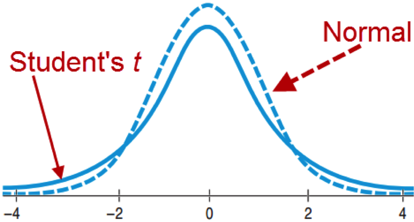
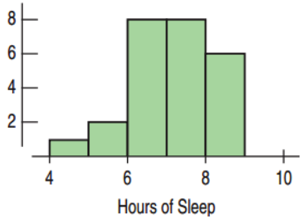
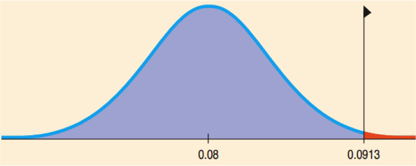
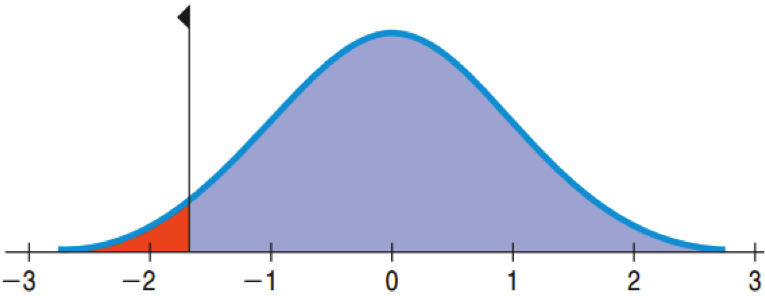

## The Challenge of the CLT

* CLT tells us $SD(\bar{y}) = \frac{\sigma}{\sqrt{n}}$
* We would like to use this for Confidence Intervals and Hypothesis Testing.
* Unfortunately, we almost never know $\sigma$.
* Using s almost works: $SE(\bar{y}) = \frac{s}{\sqrt{n}}$, but not quite.
* When using s, the Normal model has some error.
* William Gosset came up with new models, one for each n that works better.

---

## Gosset the Brewer


* At Guinness, Gosset experimented with beer.
* The Normal Model was not right, especially for small samples.
* Still bell shaped, but details differed, depending on n
* Came up with the “Student’s t Distribution” as the correct model

<center></center>

--- &twocol

## Degrees of Freedom

*** left

* For every sample size n there is a different Student’s t distribution.
* Degrees of freedom: df = n – 1.
* Similar to the “n – 1” in the formula for sample standard deviation
* It is the number of independent quantities left after we’ve estimated the parameters.

*** right

```{r comparetdistributions, width=6, height=5, echo=FALSE}
x <- seq(-4, 4, length=100)
hx <- dnorm(x)

degf <- c(1, 3, 8, 30)
colors <- c("red", "blue", "darkgreen", "gold", "black")
labels <- c("df=1", "df=3", "df=8", "df=30", "normal")

plot(x, hx, type="l", lty=2, xlab="x value",
  ylab="Density", main="Comparison of t Distributions")

for (i in 1:4){
  lines(x, dt(x,degf[i]), lwd=2, col=colors[i])
}

legend("topright", inset=.05, title="Distributions",
  labels, lwd=2, lty=c(1, 1, 1, 1, 2), col=colors)
```

---

## Confidence Interval for Means

Sampling Distribution Model for Means
* With certain conditions (seen later), the standardized sample mean follows the Student’s t model with n – 1 degrees of freedom.

$$t = \frac{ \bar{y}-\mu }{ SE(\bar{y}) }$$

* We estimate the standard deviation with

$$ SE(\bar{y}) = \frac{s}{\sqrt{n}}$$

---

## One Sample t-Interval for the Mean

When the assumptions are met (seen later), the confidence interval for the mean is

$$\bar { y } ={ t }_{ n-1 }^{ * }\times SE(\bar{y})$$

The critical value ${ t }_{ n-1 }^{ * }$ depends on the confidence level, C, and the degrees of freedom n – 1. 

--- &twocol

## Contaminated Salmon

*** left

A study of mirex concentrations in salmon found
* n = 150, $\bar{y} = 0.0913$ ppm, s = 0.0495 ppm
* Find a 95% confidence interval for mirex concentrations in salmon.
* df = 150 – 1 = 149
* $SE(\bar{y}) = \frac{0.0485}{\sqrt{150}} \approx 0.0040$
* ${ t }_{ 149 }^{ * } = 1.976$

```{r}
qt(.975, 149)
```

*** right

$\bar{y} \pm { t }_{ 149 }^{ * } \times SE(\bar{y}) = 0.0913 \pm 1.976(0.0040)$
$\bar{y} \pm { t }_{ 149 }^{ * } \times SE(\bar{y}) = (0.0834, 0.0992)$

* I’m 95% confident that the mean level of mirex concentration in farm-raised salmon is between 0.0834 and 0.0992 parts per million.

---

## Notes about z and t

The Student’s t distribution:
* Is unimodal.
* Is symmetric about its mean.
* Has higher tails than Normal.
* Is very close to Normal for large df.
* Is needed because we are using s as an estimate for s.

If you happen to know $\sigma$, which almost never happens, use the Normal model and not Student’s t.

---

## Assumptions and Conditions

Independence Condition
* Randomization  Condition:  The data should arise from a suitably randomized experiment.
* Sample size < 10% of the population size.

Nearly Normal
* For large sample sizes (n > 40), not severely skewed.
* (15 ≤ n ≤ 40):  Need unimodal and symmetric.
* (n < 15):  Need almost perfectly normal.
* Check with a histogram.

--- &twocol

## How Much Sleep do College Students Get?

*** left

Build a 90% Confidence Interval for the Mean.

Plan:  Data on 25 Students



Model
* Randomization Condition  
The data are from a random survey.
* Nearly Normal Condition  
Unimodal and slightly skewed, so OK
* Use Student’s t-Model with df = 25 – 1 = 24.
* One-sample t-interval for the mean

*** right

Mechanics
* n = 25; $\bar{y} = 6.64$; s = 1.075
* $SE(\bar{y}) = \frac{s}{\sqrt{n}} = \frac{1.075}{\sqrt{25}} = 0.215 hours$
```{r}
qt(.95, 24)
```
* ${ t }_{ 24 }^{ * } = 1.711$
* $ME = { t }_{ 24 }^{ * } \times SE{\bar{y}} = 1.711 \times 0.215$  
$= 0.368 hours$

90% $ CI = 6.64 \pm 0.368$

---

## How Much Sleep do College Students Get?

Conclusion:  I’m 90 percent confident that the interval from 6.272 and 7.008 hours contains the true population mean number of hours that college students sleep. 

### What Not to Say

“90% of all students sleep between 6.272 and 7.008 hours each night.”
* The CI is for the mean sleep, not individual students.

“We are 90% confident that a randomly selected student will sleep between 6.272 and 7.008 hours per night.”
* We are 90% confident about the mean sleep, not an individual’s sleep.

“The mean amount of sleep is 6.64 hours 90% of the time.”
* The population mean never changes.  Only sample means vary from sample to sample.

“90% of all samples will have a mean sleep between 6.272 and 7.008 hours per night.”
* This interval does not set the standard for all other intervals.  This interval is no more likely to be correct than any other.

---

## One-Sample t-Test for the Mean

* Assumptions are the same.
* $H_0: \mu = \mu_0$ 
* ${ t }_{ n-1 }^{ * } = \frac{\bar{y} - \mu_0}{SE(\bar{y})}$
* Standard Error of $\bar{y}:SE(\bar{y})=\frac{\sigma}{\sqrt{n}}$
* When the conditions are met and $H_0$ is true, the statistic follows the Student’s t Model.
* Use this model to find the P-value.

---

## Are the Salmon Unsafe?



EPA recommended mirex screening is 0.08 ppm.
* Are farmed salmon contaminated beyond the permitted EPA level?
* Recap:  Sampled 150 salmon.  Mean 0.0913 ppm, Standard Deviation 0.0495 ppm.
* $H_0: \mu = 0.08$
* $H_A: \mu > 0.08$

---

## Are the Salmon Unsafe?

One-Sample t-Test for the Mean

* n=150; df=149; $\bar{y}=0.0913$; s=0.0495
* $SE(\bar{y}) = \frac{0.0495}{\sqrt{150}} \approx 0.0040$
* ${ t }_{ 149 }^{ * } = \frac{0.0913 - 0.08}{0.0040} = 2.825$
* $P(t_149 > 2.825) = 0.0027$
```{r}
1 - pt(2.825, 149)
```
* Since the P-value is so low, reject H0 and conclude that the population mean mirex level does exceed the EPA screening value.

---

## Do Students Get at Least Seven Hours of Sleep? 25 Surveyed.


* Plan: Does the mean amount of sleep exceed 7 hours?
* Hypotheses:  $H_0: \mu = 7;  H_A: \mu > 7$
* Model
	* Randomization Condition:  The students were randomly andindependently selected .
	* Nearly Normal Condition:  unimodal and symmetric
* Use the Student’s t-model, df = 24
* One-sample t-test for the mean

--- &twocol




## Do Students Get at Least Seven Hours of Sleep? 25 Surveyed.

*** left

Mechanics
* n = 25; $\bar{y} = 6.64$; s = 1.075
* $SE(\bar{y}) = \frac{s}{\sqrt{n}} = \frac{1.075}{\sqrt{25}} = 0.215 hours$
* $t = \frac{\bar{y} - \mu_0}{SE(\bar{y})} = \frac{6.64 - 7}{0.215} \approx -1.67$
* P-value$ = P(t_{25} < -1.67) \approx 0.054$
```{r}
pt(-1.67, 24)
```

*** right

Conclusion: P-value = 0.054 says thatif students do sleep an average of 7 hrs., samples of 25 students can be expected to have an observed mean of 6.64 hrs. or less about 54 times in 1000. 
* With 0.05 cutoff, there is not quite enough evidence to conclude that the mean sleep is less than 7.  
* The 90% CI:  (6.272, 7.008) contains 7.  
* Collecting a larger sample would reduce the ME and give us a better handle on the true mean hours of sleep.

---

## Intervals and Tests

Confidence Intervals
* Start with data and find plausible values for the parameter.
* Always 2-sided

Hypothesis Tests
* Start with a proposed parameter value and then use the data to see if that value is not plausible.
* 2-sided test:  Within the confidence interval means fail to reject $H_0$.  P-value = 1 – C is the cutoff.
* 1-sided test:  P-value = (1 – C)/2 is the cutoff.

---

## Sleep, Confidence Intervals and Hypothesis Tests

90% Confidence interval:  (6.272, 7.008)
* For a 2-tailed test with a 10% cutoff, any $6.272 \le \mu_0 \le 7.008$ would result in failing to reject $H_0$.
* For a 1-tailed test (“<”) with a 5% cutoff, any $\mu_0 \le 7.008$ would result in failing to reject $H_0$.
* For a 1-tailed test (“>”) with a 5% cutoff, any $6.272 \le \mu_0$ would result in failing to reject $H_0$.

---

## The Challenge of Finding the Sample Size

$$ME = { t }_{ n-1 }^{ * } \times \frac{s}{\sqrt{n}} $$

To find the necessary sample size in order to have a small enough margin of error:
* Decide on acceptable ME.
* Determine s:  Use a pilot to estimate s.
* Determine ${ t }_{ n-1 }^{ * }$:  Use z* as an estimate.  By the 68-95-99.7 Rule, use 2 for 95% confidence.


