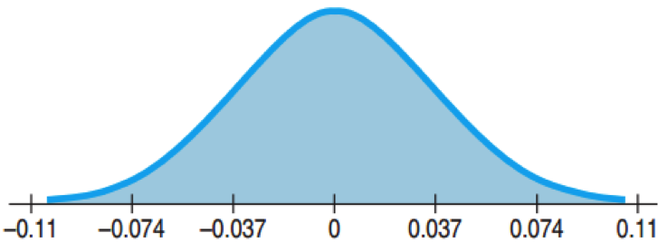
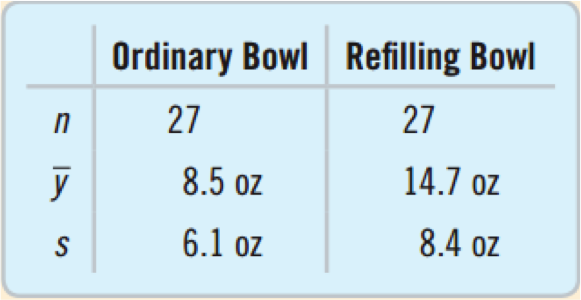
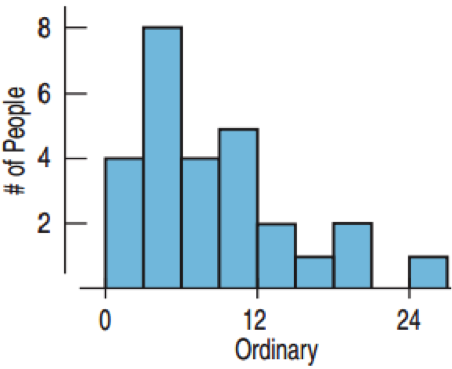
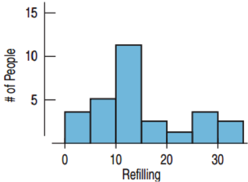
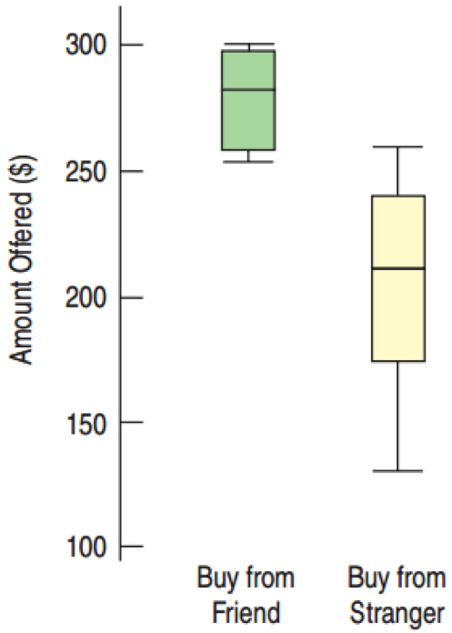

## Standard Deviation of a Difference

57% of 248 boys aged 15-17 have online profiles.  70% of 256 girls aged 15-17 have online profiles.
* What is the standard error of the difference?
* The boys and girls were selected at random, so independent

$$SE(\hat{p}_{boys}) = \sqrt{ \frac{(.57)(.43)}{248} } \approx 0.0314$$
$$SE(\hat{p}_{girls}) = \sqrt{ \frac{(.70)(.30)}{256} } \approx 0.0286$$

$$SE(\hat{p}_{boys} - \hat{p}_{girls}) = \sqrt{0.0314^2 + 0.0286^2} \approx 0.0425$$

---

## Assumptions and Conditions for Comparing Proportions

Independence Assumption:  Check
* Randomization  Condition:  The data are drawn independently and randomly.
* 10% Condition:  If without replacement, the data represent less than 10% of the population.

Independent Groups Assumption
* The two groups are independent of each other.
* Comparing wives and husbands or before and after can give a smaller difference between SDs.

Sample size
* Successes and Failures for both $\ge 10$

---

## Sampling Distribution for the Difference Between Two Independent Proportions

If samples are independent (individually and by groups) and the sample sizes are large,  then the sampling distribution of $\hat{p}_1 - \hat{p}_2$ 
* Follows a Normal model
* Has mean $\mu = p_1 – p_2$
* Has standard deviation
$$ SD(\hat { p } _{ 1 }-\hat { p } )=\sqrt { \frac { { p } _{ 1 } { q } _{ 1 } }{ n_{ 1 } } +\frac {  { p } _{ 2 } { q } _{ 2 } }{ n_{ 2 } }  }  $$

---

## Two-Proportion z-Interval

If the conditions are met, the confidence interval for $p_1 – p_2$ is

$$ (\hat{p}_1 - \hat{p}_2) \pm z^* \times SE(\hat{p}_1 - \hat{p}_2) $$
$$ SE(\hat { p } _{ 1 }-\hat { p } )=\sqrt { \frac { \hat { p } _{ 1 }\hat { q } _{ 1 } }{ n_{ 1 } } +\frac { \hat { p } _{ 2 }\hat { q } _{ 2 } }{ n_{ 2 } }  } $$

* z* is the critical value that corresponds to the confidence level C.

---

## Online Presence:  Boys vs. Girls

57% of the 248 boys had an online profiles.
70% of the 256 girls had an online profiles.
What does the confidence interval say about the difference?

$$ (\hat{p}_{boys} - \hat{p}_{girls}) \pm z^* \times SE(\hat{p}_{boys} - \hat{p}_{girls}) $$
$$(0.7 - 0.57) \pm 1.96 \times 0.0425$$
$$(4.75\%, 21.3\%) $$

We are 95% confident that the proportion of teen girls who post online is between 4.7% and 21.3% higher than for boys.

--- &twocol

## Wearing Seat Belts

Question:  How much difference is therein the proportion of male drivers who wear seat belts when sitting next to a man and the proportion when sitting next to a woman?

*** left

* Plan:  Want a 95% confidence interval for $p_F – p_M$
* Data are from a random sample of MA drivers.

Model:  
* Randomization Condition:  Participants selected randomly and independently from car to car.
* 10% Condition:  Sample size is less than 10% of all drivers.

*** right

* Independent Groups Assumption:  The seat-belt use with male and female passengers are independent.


Success Failure Condition:  
* With female passengers:  2777 wore seat belts,  1431 did not.
* With male passengers:  1363 wore seat belts,  1400 did not.
* All successes and failures ≥ 10.

All conditions are met.  Use the Normal model and find a 2-proportion z-interval.

---

## Wearing Seat Belts

$$n_F = 4208, n_M = 2763$$
$$\hat{p}_F = \frac{2777}{4208} \approx 0.660, \hat{p}_M = \frac{1363}{2763} \approx 0.493$$
$$SE(\hat{p}_F - \hat{p}_M) = \sqrt{\frac{\hat{p}_F \hat{q}_F}{n_F} + \frac{\hat{p}_M \hat{q}_M}{n_M}} = \sqrt{\frac{(0.660)(0.340)}{4208} + \frac{(0.493)(0.507)}{2763}} \approx 0.012$$
$$ME = z^* \times SE(\hat{p}_F - \hat{p}_M) \approx 1.96 \times 0.012 \approx 0.024$$
$$ \hat{p}_F - \hat{p}_M = 0.660 - 0.493 = 0.167$$
95% Condifdence Interval:
$$0.167 \pm 0.024 = (14.3\%, 19.1\%)$$

---

## Wearing Seat Belts

Conclusion: I am 95% confident that the proportion of male drivers who wear seat belts when driving next to a female passenger is between 14.3 and 19.1 percentage points higher than the proportion who wear seat belts when driving next to a male passenger.

Caution
* Can’t generalize to other states
* Can’t say men buckle up because of the women; Lurking variables such as age may be present.

---

## Internet Before Sleep

The Sleep in America Poll found that 205 of 293, or 70%, of Gen-Y use the Internet before sleep.  235 of 469, or 50%, of Gen-X use the Internet before sleep. 

* Is this difference of 20% real or is it likely to be due only to natural fluctuations in the sample?
* $H_0:  p_1 – p_2 = 0$
* For CI: $SE(\hat{p}_1 - \hat{p}_2) = \sqrt { \frac { \hat { p } _{ 1 }\hat { q } _{ 1 } }{ n_{ 1 } } +\frac { \hat { p } _{ 2 }\hat { q } _{ 2 } }{ n_{ 2 } }  }$
* For hypothesis testing, we can do better.

---

## Pooling the Proportion

* $H_0$ says the proportions are equal.
* $p_1$ and $p_2$ should equal the total proportion of successes.
* Total successes:  205 + 235 = 440
* Total trials:  293 + 469 = 762
* Pooled Proportion:  

$$ \hat{p}_{pooled} = \frac{{success}_1 + {success}_2}{n_1 + n_2} = \frac{440}{762} \approx 0.5774 $$

---

## Standard Error for Internet Before Sleep

The Sleep in America Poll found that 205 of 293 or 70% of Gen-Y use the Internet before sleep.  235 of 469 or 50% of Gen-X use the Internet before sleep. 

$$ SE_{pooled}(\hat{p}_{1} - \hat{p}_{2}) = \sqrt{\frac{\hat{p}_{pooled} \hat{q}_{pooled}}{n_1} + \frac{\hat{p}_{pooled} \hat{q}_{pooled}}{n_2}} $$
$$ SE_{pooled}(\hat{p}_{1} - \hat{p}_{2}) = \sqrt{\frac{0.5774(1-0.5774)}{293} + \frac{0.5774(1-0.5774)}{469}} $$
$$ SE_{pooled}(\hat{p}_{1} - \hat{p}_{2}) \approx 0.0368 $$

---

## Two-Proportion z-Test

* Conditions same as 2-proportion CI.
* $H_0$: $p_1 – p_2 = 0$
* $\hat{p}_{pooled} = \frac{Success_1 + Success_2}{n_1 + n_2}$
* $SE_{pooled}(\hat{p}_{1} - \hat{p}_{2}) = \sqrt{\frac{\hat{p}_{pooled} \hat{q}_{pooled}}{n_1} + \frac{\hat{p}_{pooled} \hat{q}_{pooled}}{n_2}}$
* $z = \frac{\hat{p}_1 - \hat{p}_2 - 0}{SE_{pooled}(\hat{p}_1 - \hat{p}_2)}$
* The statistic follows the Normal model. 

---

## Pre-Sleep Internet Rates Differ?

* Plan:  Random sample ofadults: 293 Gen Y, 469 Gen X
* Hypotheses:  
	* $H_0$:  $p_{GenY} – p_{GenX}  =  0$
	* $H_A$:  $p_{GenY} – p_{GenX}  \ne  0$

Model
* Randomization Condition:  Randomly selected and stratified by sex.
* 10% Condition:  Samples less than 10% of all Gen X and Gen Y.
* Independent Groups Assumption:  The samples were selected at random so independent.
* Success/Failure Condition:  Observed numbers of successes and failures for both groups ≥ 10.

The conditions are all met.  Use the Normal model and perform a two-proportion z-test.

---

## Pre-Sleep Internet Rates Differ?

$$n_{GenY} = 293, n_{GenX} = 469$$
$$y_{GenY} = 205, y_{GenX} = 235$$
$$\hat{p}_{GenY} = 0.700, \hat{p}_{GenX} = 0.501$$
$$\hat{p}_{pooled} = \frac{y_{GenY} + y_{GenX}}{n_{GenY} + n_{GenX}} = \frac{205 + 	235}{293 + 469} \approx 0.5774$$
$$SE(\hat { p } _{ GenY }-\hat { p } _{ GenX })=\sqrt { \frac { \hat { p } _{ pooled }(1-\hat { p } _{ pooled }) }{ n_{ GenY } } +\frac { \hat { p } _{ pooled }(1-\hat { p } _{ pooled }) }{ n_{ GenX } }  }$$
$$SE(\hat { p } _{ GenY }-\hat { p } _{ GenX })=\sqrt { \frac { (0.5774)(0.4226) }{ 293 } +\frac { (0.5774)(0.4226) }{ 469 }  } \approx 0.0368$$

---

## Pre-Sleep Internet Rates Differ?

$$\hat{p}_{GenY} - \hat{p}_{GenX} = 0.700 - 0.501 = 0.199$$
$$ z = \frac{(\hat{p}_{GenY} - \hat{p}_{GenX}) - 0}{SE_{pooled}(\hat{p}_{GenY} - \hat{p}_{GenX})} = \frac{0.199}{0.0368} \approx 5.41$$

$$ P-value = 2 \times P(z > 5.41) \le 0.0001$$



Conclusion: P-value ≤ 0.0001:  If there really was no difference in surfing rates between the two groups, then the difference observed in this study would be very rare indeed.

We can conclude that there is, in fact, a difference in the rate of surfing between GenY and GenX adults.

---

## Difference Between Means: Standard Error

* $Var(\bar{Y}_1 - \bar{Y}_2) = Var(\bar{Y}_1) + Var(\bar{Y}_2)$
* $SD(\bar{Y}_1 - \bar{Y}_2) = \sqrt{Var(\bar{Y}_1) + Var(\bar{Y}_2)}$
* $SD(\bar{Y}_1 - \bar{Y}_2) = \sqrt{\frac{\sigma_1^2}{n_1} + \frac{\sigma_2^2}{n_2}}$

Don’t know the population SDs, so use the sample SDs: 

$$SE(\bar{Y}_1 - \bar{Y}_2) = \sqrt{\frac{s_1^2}{n_1} + \frac{s_2^2}{n_2}}$$

---

## Effect of Knowing How Much We Eat



* 27 people observed eating soup from ordinary bowl.
* 27 people observed eating soup from a bowl that slowly refills without the person knowing.
* Find the standard error.

$SE(\bar{y}_{refill} - \bar{y}_{ordinary}) = \sqrt{\frac{s^2_r}{n_r} + \frac{s^2_o}{n_o}} = \sqrt{\frac{8.4^2}{27} + \frac{6.1^2}{27}} \approx 2.0 oz$

---

## Sampling Distribution for the Difference Between Two Means

* When the assumptions are met, the sampling distribution for the difference between two independent means:

$$t = \frac{(\bar{Y}_1 - \bar{Y}_2) - (\mu_1 - \mu_2)}{SE(\bar{Y}_1 - \bar{Y}_2)}$$
$$SE(\bar{Y}_1 - \bar{Y}_2) = \sqrt{\frac{s^2_1}{n_1} + \frac{s^2_2}{n_2}}$$

* Uses the Student’s t-model
* The degrees of freedom are complicated, so just use a computer.

---

## Assumptions and Conditions

Independence
* Same assumptions as proportions
* Between and within groups
* Randomization is evidence of independence.
* If not independent, can you use pairing?

Nearly Normal Condition
* Same as with a single mean, but must check both.
* n < 15:  must be very close to normal.
* 15 ≤ n ≤ 40:  Check for outliers and skewness.
* n > 40:  Fine as long as no extreme outliers or extreme skewness

--- &twocol

## Checking Conditions for Soup Experiment

*** left

* Randomization Condition:  The subjects were randomly assigned.
* Nearly Normal Condition: n = 27 for both.  Histograms only a little skewed.  No outliers.
* Independent Groups Assumption:  Randomization to treatment groups guarantees this
* Okay to construct a two-sample t-interval for the difference between two means.

*** right

<center>


</center>

---

## Two-Sample t-Interval for the Difference Between Two Means

When the conditions are met, the confidence interval for the difference between means from two independent groups is:

$$(\bar{Y}_1 - \bar{Y}_2) \pm t^*_{df} \times SE(\bar{Y}_1 - \bar{Y}_2)$$
$$SE(\bar{Y}_1 - \bar{Y}_2) = \sqrt{\frac{s^2_1}{n_1} + \frac{s^2_2}{n_2}}$$

---

## Confidence Interval for Soup Experiment


* What does a 95% confidence interval say about the difference in mean amounts eaten?
* $\bar{Y}_{refill} - \bar{Y}_{ordinary} = 14.7 - 8.5 = 6.2$
* $t^*_{df} = 2.011$ (by computer)
* $ME = t^*_{df} \times SE(\bar{Y}_{refill} - \bar{Y}_{ordinary}) = 2.11 \times 2.0 \approx 4.02$
* CI: $6.2 \pm 4.02 = (2.18, 10.22)$
* I am 95% confident that people eating from a refilling bowl will eat between 2.18 and 10.22 more ounces than those eating from an ordinary bowl.

---

## Two-Sample t-Test for the Difference Between Means

* Conditions same as two-sample t-interval
* $H_0:  \mu_1 – \mu_2 = \Delta_0$  ($\Delta_0$ usually 0)
* $t = \frac{(\bar{Y}_1 - \bar{Y}_2) - \Delta_0}{SE(\bar{Y}_1 - \bar{Y}_2)}$
* $SE(\bar{Y}_1 - \bar{Y}_2) = \sqrt{\frac{s^2_1}{n_1} + \frac{s^2_2}{n_2}}$

* When the conditions are met and the null hypothesis is true, use the Student’s t-model to find the P-value.

---

## Do People Offer a Lower Price to Friends than to Strangers?

Is there a difference in the average price for a used camera people would offer a friend and a stranger?



* Plan:  I have bid prices from 8 subjects buying from a friend and 7 buying from a stranger, found in a randomized experiment.
* Hypotheses
	* $H_0:  \mu_F – \mu_s = 0$
	* $H_A:  \mu_F – \mu_s \ne 0$

---

## Do People Offer a Lower Price to Friends than to Strangers?


* Model:  Has practical significance, but is there statistical significance?
	* Randomization  Condition:  Subjects assigned to treatment groups randomly.
	* Independent Groups Assumption:  Randomizing gives independent groups.
	* Nearly Normal  Condition:  Histograms are reasonably unimodal and symmetric, but with the very small sample sizes, we should be concerned.

* The assumptions and conditions are somewhat reasonable.  
* Use the Student’s t-model to perform a two-sample t-test.

---

## Friends vs. Strangers

$$n_F = 8, n_S = 7$$
$$\bar{Y}_F = 281.88, \bar{Y}_S = 211.43$$
$$S_F = 18.31, S_S = 46.43$$
$$SE(\bar{Y}_F - \bar{Y}_S) = \sqrt{\frac{18.31^2}{8} + \frac{46.43^2}{7}} \approx 18.70$$
$$\bar{Y}_F - \bar{Y}_S = 281.88 - 211.43 = 70.45$$
$$t = \frac{70.45}{18.70} \approx 3.77$$
$$P-value = 2 \times P(t > 3.77) = 0.006$$

---

## Friends vs. Strangers

* Conclusion:  The P-value = 0.006 is very small.
* If there were no difference in the mean prices, then a difference this large would occur 6 times in 1000.
* Too rare to believe
* Reject $H_0$.
* Conclude that people are likely, on average, to offer a friend more than they’d offer a stranger for a used camera.

--- &twocol

## Public vs. Private Schools

*** left

```{r, tidy=FALSE}
describeBy(pisa.USA$reading, 
group=pisa.USA$PUBPRIV, mat=TRUE, 
skew=FALSE)[,2:6]
```

*** right

```{r pisareadingboxplot, fig.width=5, fig.height=6, tidy=FALSE}
ggplot(pisa.USA, aes(x=PUBPRIV, 
y=reading)) + geom_boxplot()
```


---

## Public vs. Private Schools

```{r}
t.test(reading ~ PUBPRIV, data=pisa.USA)
```

---

## Pooling

If the variances are equal, we can use pooling.
* Advantages of Pooling
	* Can have more degrees of freedom than two sample t-test.
	* More degrees of freedom gives a higher power.
* Disadvantage of Pooling
	* The assumption of equal variances is difficult to establish and often false.

---

## Pooled Variance and Standard Error

Pooled variance:

$$s^2_{pooled} = \frac{(n_1- 1)s^2_{1} + (n_2 - 1)s^2_{2}}{(n_1 - 1) + (n_2 - 1)}$$

Pooled standard error:

$$SE_{ pooled }=\sqrt { \frac { s^{ 2 } }{ _{ pooled } } { n_{ 1 } }+\frac { s^{ 2 }_{ pooled }}{ n_{ 2 } } } =s_{ pooled }\sqrt { \frac { 1 }{ n_{ 1 } } +\frac { 1 }{ n_{ 2 } }  } $$

--- &twocol

## Pooled t-Test and Confidence Interval for Means

*** left

* Conditions same as two-sample t-interval/test plus the variances must be equal.
* $H_0:  \mu_1 – \mu_2 = \Delta_0$  ($\Delta_0$ usually 0)
* $t = \frac{(\bar{Y}_1 - \bar{Y}_2) - \Delta_0}{SE(\bar{Y}_1 - \bar{Y}_2)}$
* $SE(\bar{Y}_1 - \bar{Y}_2) = \sqrt{\frac{s^2_1}{n_1} + \frac{s^2_2}{n_2}}$
* $s^2_{pooled} = \frac{(n_1 - 1)s^2_1 + (n_2 - 1)s^2_2}{(n_1 - 1) + (n_2 - 1)}$

*** right

When the conditions are met and the null hypothesis is true, use the Student’s t-model with $(n_1 – 1) + (n_2 – 1)$ degrees of freedom.
* Use the model to find the P-value or margin of error.
* The CI is:   
$(\bar{y}_1 - \bar{y}_2) \pm t^*_{df} \times SE_{pooled}(\bar{y}_1 - \bar{y}_2)$                            
* $df = (n_1 – 1) + (n_2 – 1)$
* The t* depends on the confidence level.

---

## When to Use the Pooled t-Test

* The pooled t-test has almost no advantage over the independent sample t-test.
* A great disadvantage is that the pooled t-test is very poor when the standard deviations are not the same.
* Avoid this test unless you are very certain that the variances (standard deviations) are the same.


